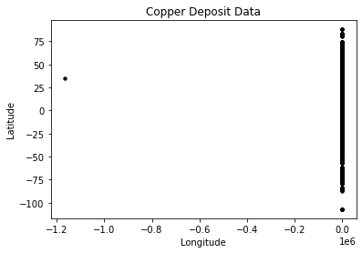
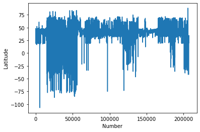
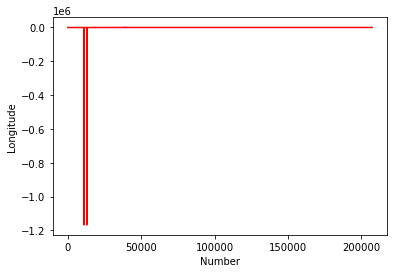
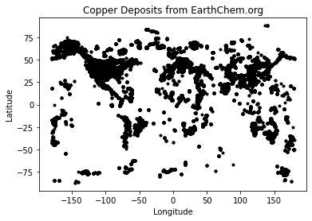
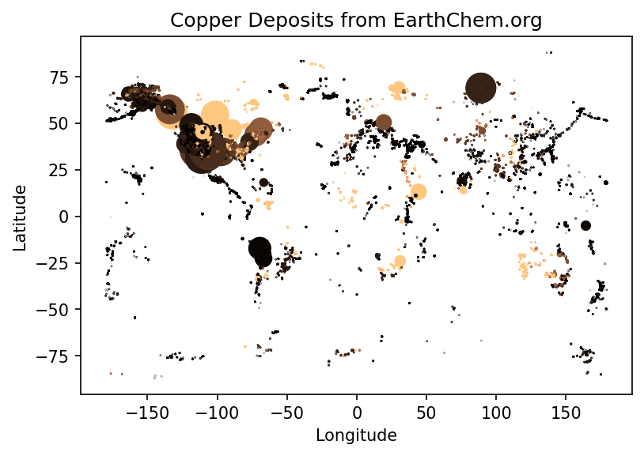
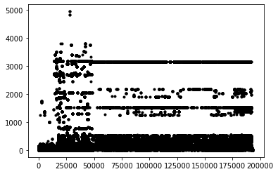
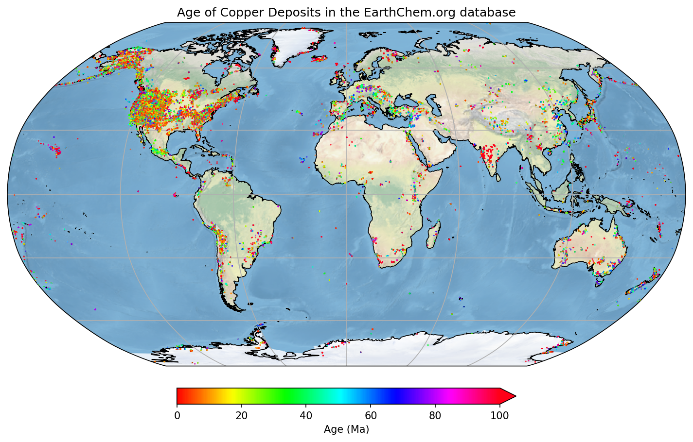

# Python fundamentals

<div class="questions">  
### Questions

- What can Python do?
- How do I do it?
</div>

<div class="objectives">  
### Objectives

- Learn the basic Python commands

</div>


Generally, cells like this are what to type into your Python shell/notebook/colab:


```python
2+4*10
```


    42


Cells like the above are the expected output.

Look at that, your first Python code! Who knew Python is just a big ol' calculator! But it can do so much more...


```python
#This is a comment. This is for a human to read (so you remember what your code does!)
#Python ignores anything behind the '#'.

#The next line is an example of a 'variable'. Assign values using a single '=' sign.
timeStart=145
```

Note: A variable (e.g. timeStart) must start with a letter or underscore, and can include a number


```python
#Now you can use that variable in different ways.... firstly print it out to the screen
print("The age of the sample is", timeStart, " Million years")
```

    The age of the sample is 145  Million years


```python
#Make a new variable called 'endtime' and add a constant to our 'timeStart' variable
endtime=timeStart+56
```

Nothing printed out above? Good. Jupyter Notebooks won't always do that so let's tell Python to print it.


```python
print(endtime)
```

    201


```python
#Make a new 'string' variable
geological_age='Jurassic'

#Print out some useful information that includes our different variables
print("My sample is ", endtime, " Million years old, from the", geological_age, " age.")
```

    My sample is  201  Million years old, from the Jurassic  age.


```python
#Make a Python List object, similar to an array.
times=[1,4.5,5+3.2,geological_age,"Another string",True]

print(times)

#There are many different types of data types and objects: 
#int, long, float, complex, NaN, logical, String, Lists, Tuple, Dictionary, functions, classes, etc
```

    [1, 4.5, 8.2, 'Jurassic', 'Another string', True]


```python
#indexing
print(times[0])
print(times[4])
print(times[4][0])
```

    1
    Another string
    A


### Functions
These are bits of code you want to perhaps use many times, or keep self contained, or refer to at different points. They can take values as input and give values back (or not). 


```python
#Declare the name of the function
def add_numbers(x,y):
    '''adds two numbers
    usage: myaddition=addnumbers(x,y)
    returns: z
    inputs: x,y
    x and y are two integers
    z is the summation of x and y
    '''
    
    z=x+y
    
    return(z)
```

**Note the indentation** - Python forces your code to be nicely readable by using 'whitespace'/indentation to signify what chunks of code are related. You will see this more later, but generally you should try and write readable code and follow [style standards](https://www.python.org/dev/peps/pep-0008/)
    
Many functions have a header - formatted as a multiline comment with three '''. This hopefully will tell you about the function

Anyway, let's run our function, now that we have initialised it!


```python
add_numbers(1,2)
```


    3


<div class="challenge">
### Challenge 

Write a function to convert map scale. For example, on a 1:25,000 map (good for hiking!) the distance between two points is 15 cm. How far apart are these in real life? (3750 m).

[Reminder: 15 cm * 25000 = 375000 cm = 3750 m]

Your function should take as input two numbers:  the distance on the map (in cm) and the second number of the scale and, i.e. `calculate_distance(15, 25000)` should return 375000

<details>
<summary>Solution</summary>


```python
#Declare the name of the function
def calculate_distance(distance_cm,scale):
    '''calculates distance based on map and scale
    returns: z
    inputs: distance_cm,scale
    distance_cm and scale are two integers
    returns the product of distance_cm and scale
    '''  
    
    return(distance_cm * scale)
```

### Loops, operators, conditions
Python is great for doing something a million times. It can be useful if you have many samples/data points and you want to operate or manipulate those points.


```python
#Loop through our list 'times' that we defined above
for mything in times:
    print(mything)
```

    1
    4.5
    8.2
    Jurassic
    Another string
    True


Sometimes you need to loop through a list, but simultaneously keep track of which index you're up to.


```python
for myindex, mything in enumerate(times):
    print("index:",myindex," The thing in my 'times' list:",mything)
```

    index: 0  The thing in my 'times' list: 1
    index: 1  The thing in my 'times' list: 4.5
    index: 2  The thing in my 'times' list: 8.2
    index: 3  The thing in my 'times' list: Jurassic
    index: 4  The thing in my 'times' list: Another string
    index: 5  The thing in my 'times' list: True


You don't always need a pre-defined list


```python
age=140
# What is the value of "timeStart" ?
# age < timeStart is a "logical" data-type. It's either True or False
while age < timeStart:
    print("time:", timeStart, " age:", age, " difference:",timeStart-age)
    #Increment the age variable
    age=age+1
```

    time: 145  age: 140  difference: 5
    time: 145  age: 141  difference: 4
    time: 145  age: 142  difference: 3
    time: 145  age: 143  difference: 2
    time: 145  age: 144  difference: 1


### Control statements

Control statements include the functions `if`, `for`, `while`, `try`.


```python
#Control statements: if, for, while, try, 
if timeStart < 200:
    print(timeStart)
```

    145


```python
if timeStart <= 200:
    print(geological_age)
elif timeStart > 200:
    print("Triassic age")
else:
    pass #This option is not necessarily needed, but can be useful in some scenarios
```

    Jurassic


```python
#Another function
def timescale(t):
    print(t)
    if (t <= 4500) & (t > 2500):
        return("Archean")

    elif (t <=2500) & (t > 541):
        return("Proterozoic")

    elif (t <= 541) & (t > 252):
        return("Palaeozoic")

    elif (t <=252) & (t > 65):
        return("Palaeozoic")

    elif (t <=65) & (t >= 0):
        return("Cenozoic")

    else:
        print ("Expect number between 0 and 4500, got:",t)
        return(float('nan'))
    
timescale(1)
```

    1


    'Cenozoic'


That is the basics. Now we are going to load in some data and manipulate it.

# Dealing with data


```python
#First we have to load some modules to do the work for us.
#Modules are packages people have written so we do not have to re-invent everything!

#The first is NUMerical PYthon. A very popular matrix, math, array and data manipulation library.
import numpy

#This is a library for making figures (originally based off Matlab plotting routines)
#We use the alias 'plt' because we don't want to type out the whole name every time we reference it!
import matplotlib.pyplot as plt 
```


```python
#Set the variable name for the file we are loading in. 
#It is in the 'data' directory, and the file is called EarthChemCU.txt. 
#We are currently working in /notebooks.
filename = '../data/EarthChemCU.txt'

#Now read in the data
# loadtxt() is a function that we can now use because we loaded the library called numpy
chemdata=numpy.loadtxt(filename, delimiter=',')
#chemdata <- the name of a variable we are making that will hold the table of data
#filename <- this is the name of the variable we declared above
#delimiter <- this is a csv file
```

#### Alternative instructions if you are using Google Colab
If you are using Google Colab, the data will not be stored on your system - but you can load it in from a url. Replace the above cell with the following commands:
```python
import urllib.request
chemdata=numpy.loadtxt(urllib.request.urlopen("https://cloudstor.aarnet.edu.au/plus/s/EaZN6DNLvpXfV1o/download"), delimiter=',')
```

### Want more details about a command/function we use?


```python
#Try this help command
help(numpy.loadtxt)
```

    Help on function loadtxt in module numpy:
    
    loadtxt(fname, dtype=<class 'float'>, comments='#', delimiter=None, converters=None, skiprows=0, usecols=None, unpack=False, ndmin=0, encoding='bytes', max_rows=None)
        Load data from a text file.
        
        Each row in the text file must have the same number of values.
        
        Parameters
        ----------
        fname : file, str, or pathlib.Path
            File, filename, or generator to read.  If the filename extension is
            ``.gz`` or ``.bz2``, the file is first decompressed. Note that
            generators should return byte strings.
        dtype : data-type, optional
            Data-type of the resulting array; default: float.  If this is a
            structured data-type, the resulting array will be 1-dimensional, and
            each row will be interpreted as an element of the array.  In this
            case, the number of columns used must match the number of fields in
            the data-type.
        comments : str or sequence of str, optional
            The characters or list of characters used to indicate the start of a
            comment. None implies no comments. For backwards compatibility, byte
            strings will be decoded as 'latin1'. The default is '#'.
        delimiter : str, optional
            The string used to separate values. For backwards compatibility, byte
            strings will be decoded as 'latin1'. The default is whitespace.
        converters : dict, optional
            A dictionary mapping column number to a function that will parse the
            column string into the desired value.  E.g., if column 0 is a date
            string: ``converters = {0: datestr2num}``.  Converters can also be
            used to provide a default value for missing data (but see also
            `genfromtxt`): ``converters = {3: lambda s: float(s.strip() or 0)}``.
            Default: None.
        skiprows : int, optional
            Skip the first `skiprows` lines, including comments; default: 0.
        usecols : int or sequence, optional
            Which columns to read, with 0 being the first. For example,
            ``usecols = (1,4,5)`` will extract the 2nd, 5th and 6th columns.
            The default, None, results in all columns being read.
        
            .. versionchanged:: 1.11.0
                When a single column has to be read it is possible to use
                an integer instead of a tuple. E.g ``usecols = 3`` reads the
                fourth column the same way as ``usecols = (3,)`` would.
        unpack : bool, optional
            If True, the returned array is transposed, so that arguments may be
            unpacked using ``x, y, z = loadtxt(...)``.  When used with a structured
            data-type, arrays are returned for each field.  Default is False.
        ndmin : int, optional
            The returned array will have at least `ndmin` dimensions.
            Otherwise mono-dimensional axes will be squeezed.
            Legal values: 0 (default), 1 or 2.
        
            .. versionadded:: 1.6.0
        encoding : str, optional
            Encoding used to decode the inputfile. Does not apply to input streams.
            The special value 'bytes' enables backward compatibility workarounds
            that ensures you receive byte arrays as results if possible and passes
            'latin1' encoded strings to converters. Override this value to receive
            unicode arrays and pass strings as input to converters.  If set to None
            the system default is used. The default value is 'bytes'.
        
            .. versionadded:: 1.14.0
        max_rows : int, optional
            Read `max_rows` lines of content after `skiprows` lines. The default
            is to read all the lines.
        
            .. versionadded:: 1.16.0
        
        Returns
        -------
        out : ndarray
            Data read from the text file.
        
        See Also
        --------
        load, fromstring, fromregex
        genfromtxt : Load data with missing values handled as specified.
        scipy.io.loadmat : reads MATLAB data files
        
        Notes
        -----
        This function aims to be a fast reader for simply formatted files.  The
        `genfromtxt` function provides more sophisticated handling of, e.g.,
        lines with missing values.
        
        .. versionadded:: 1.10.0
        
        The strings produced by the Python float.hex method can be used as
        input for floats.
        
        Examples
        --------
        >>> from io import StringIO   # StringIO behaves like a file object
        >>> c = StringIO(u"0 1\n2 3")
        >>> np.loadtxt(c)
        array([[0., 1.],
               [2., 3.]])
        
        >>> d = StringIO(u"M 21 72\nF 35 58")
        >>> np.loadtxt(d, dtype={'names': ('gender', 'age', 'weight'),
        ...                      'formats': ('S1', 'i4', 'f4')})
        array([(b'M', 21, 72.), (b'F', 35, 58.)],
              dtype=[('gender', 'S1'), ('age', '<i4'), ('weight', '<f4')])
        
        >>> c = StringIO(u"1,0,2\n3,0,4")
        >>> x, y = np.loadtxt(c, delimiter=',', usecols=(0, 2), unpack=True)
        >>> x
        array([1., 3.])
        >>> y
        array([2., 4.])
    


Or really, [search](http://letmegooglethat.com/?q=numpy+loadtxt) the function! Online documentation and discussion boards are filled with great content.

### Exploring your data

It is often a good idea to look at the data to have some idea of what you are working with


```python
#What does the data look like. Print it out
print(chemdata)
```

    [[ 3.92583e+01 -1.14992e+02  1.11000e+02  1.96000e+04]
     [ 3.92583e+01 -1.14992e+02  1.11000e+02  1.57000e+04]
     [ 4.12060e+01 -1.17272e+02  1.05000e+02  3.00000e+00]
     ...
     [ 2.00530e+01  1.17419e+02  0.00000e+00  3.00000e+01]
     [ 2.00530e+01  1.17419e+02  0.00000e+00  3.30000e+01]
     [ 2.00530e+01  1.17419e+02  0.00000e+00  3.50000e+01]]


This data is in the style: **Latitude (degrees), Longitude (degrees -180:180), Age (Ma), Copper abundance (ppm)**


```python
#Print the dimensions of the data
print(chemdata.shape)
```

    (207431, 4)


207431 rows! 

### Accessing data from an array
chemdata is a table of data: an array with two dimensions. So to access/look at/change parts of it, we need to specify both row and column


```python
#Print the number in the first row and third column 
#(note indexing is different in "numpy arrays" compared "python lists". 
#IMPORTANT: Python counts from 0
print(chemdata[0,2])
```

    111.0


```python
#Print the first row
print(chemdata[0,:])
```

    [   39.2583  -114.992    111.     19600.    ]


```python
#Print the third column
print(chemdata[:,2])
```

    [111. 111. 105. ...   0.   0.   0.]


```python
#Print the first two columns for row id 2, 5 and 6. 
print(chemdata[[2,5,6],0:2])
```

    [[  41.206 -117.272]
     [  41.186 -117.417]
     [  41.177 -117.485]]


<div class="challenge">

### Challenge

Print the second and third columns for row 20-30. 

<details>
<summary>Solution</summary>
```python
#The indexing counts from [start:end]
#where "start" is included and "end" is excluded!
#Assuming we want row 30, then you need to
#include index 29 (i.e. set the end index to 30!)
#Same with columns, we want column 2 (index 1) and
#column 3 (index 2) so make our slice 1:3

print(chemdata[19:30,1:3])
```

</details>
</div>

### Plotting data
Now to make our first plot!


```python
#Plot the lats and lons, i.e. the first column vs the second column
plt.plot(chemdata[:,1],chemdata[:,0],'k.')
plt.title('Copper Deposit Data')
plt.ylabel('Latitude')
plt.xlabel('Longitude')
plt.show()
```


    

    


This does not look right... It is a messy dataset! This is not uncommon. 
Maybe the Lats/Lons are stored as Norhtings/Eastings for some samples?
Maybe they are missing a decimal place?

Anyway, Python is a great tool to clean things up! Let's investigate further.


```python
#Plot the Latitudes
plt.plot(chemdata[:,0])
plt.ylabel('Latitude')
plt.xlabel('Number')
plt.show()

#Plot the Longitudes
plt.plot(chemdata[:,1],'r')
plt.ylabel('Longitude')
plt.xlabel('Number')
plt.show()
```


    

    


    

    


This kind of casual data interrogation is a really handy way to exploring your data.
There are definitely some outliers with latitudes and longitudes. There are quite a few ways clean the data, but let's simply restrict our data range to -180:180 and -90:90.


```python
#Clean up the data, remove anything outside lat lon extent

#Find all the "chemdata" column 1 (i.e. longitude) data points that are greater than -180, save it in a new variable
where_longitude_above_min = chemdata[:,1]>-180
cudata=chemdata[where_longitude_above_min]

#Repeat for less than 180
where_longitude_below_max = cudata[:,1]<180
cudata2=cudata[where_longitude_below_max]
```


We can make that a little clearer now for the latitude values to see what is actually going on, by stepping through each part of the variable assignment...


```python
goodlat=cudata2[:,0]<90
print(goodlat)
```

    [ True  True  True ...  True  True  True]


```python
goodlat.shape
```


    (207422,)


```python
cudata2
```


    array([[ 3.92583e+01, -1.14992e+02,  1.11000e+02,  1.96000e+04],
           [ 3.92583e+01, -1.14992e+02,  1.11000e+02,  1.57000e+04],
           [ 4.12060e+01, -1.17272e+02,  1.05000e+02,  3.00000e+00],
           ...,
           [ 2.00530e+01,  1.17419e+02,  0.00000e+00,  3.00000e+01],
           [ 2.00530e+01,  1.17419e+02,  0.00000e+00,  3.30000e+01],
           [ 2.00530e+01,  1.17419e+02,  0.00000e+00,  3.50000e+01]])


```python
#Repeat for latitudes less than 90
cudata3=cudata2[cudata2[:,0]<90]
#Repeat for greater than -90
cudata4=cudata3[cudata3[:,0]>-90]

print("We have removed", chemdata.shape[0]-cudata4.shape[0], "samples")
```

    We have removed 47 samples


```python
plt.plot(cudata4[:,1],cudata4[:,0],'k.')
plt.title('Copper Deposits from EarthChem.org')
plt.ylabel('Latitude')
plt.xlabel('Longitude')
plt.show()
```


    

    


Now make a more informative plot:


```python
#Set reasonable variable names
lats=cudata4[:,0]
longs=cudata4[:,1]
age=cudata4[:,2]
copper=cudata4[:,3]

#lats_rich=lats[copper>2]

fig = plt.figure(figsize=(6,4),dpi=150)

#Restrict the colour range between 0 and 100 (ppm?)
plt.scatter(longs,lats,s=age/1000,c=copper,vmin=0, vmax=100,cmap=plt.cm.copper)
plt.title('Copper Deposits from EarthChem.org')
plt.ylabel('Latitude')
plt.xlabel('Longitude')
plt.show()
```


    

    


```python
#You could come up with a more intelligent way to reject your outliers, e.g.
import numpy as np
def reject_outliers(data):
    m = 2
    u = np.mean(data)
    print("mean is:", u)
    s = np.std(data)
    print("std is:", s)
    filtered = [e for e in data if (u - 2 * s < e < u + 2 * s)]
    print("removed:",np.shape(data)[0] - np.shape(filtered)[0])
    return(filtered)

filtered_age=reject_outliers(copper)

```

    mean is: 408.55060226439844
    std is: 6032.1541529827555
    removed: 1163


Just plotting the Cu content implies that better filtering could be applied (a homework exercise perhaps). Remember this is a pretty messy dataset, some Cu is reported as ppm, ppb, or %! 


```python
plt.plot(copper[copper>1],'k.')
plt.show()
```


    

    


### Let's make an even nicer map


```python
#Import another module called Cartopy - great for plotting things on globes
import cartopy.crs as ccrs

#Make new variables from our array (so it is easier to see what we are doing)
lats=cudata4[:,0]
longs=cudata4[:,1]
age=cudata4[:,2]

#######
## Make the figure
#######

#Create a figure object
fig = plt.figure(figsize=(12,8),dpi=150)

#Make a map projection to plot on.
ax = plt.axes(projection=ccrs.Robinson())

#Add some Earth-specific details (from the cartopy package)
ax.set_global()
ax.coastlines('50m', linewidth=0.8)
ax.stock_img()
ax.gridlines()

#Make a scatter plot of the data coloured by age. 
#Restrict the colour range between 0 and 100 (Ma)
#And also set the scatter plot as a variable 'mapscat' so we can reference it later
mapscat=ax.scatter(longs,lats,marker=".",s=0.5,c=age,vmin=0,vmax=100,transform=ccrs.PlateCarree(),zorder=4,cmap=plt.cm.hsv)

#Make a Colorbar
cbar=plt.colorbar(mapscat, ax=ax, orientation="horizontal", pad=0.05, fraction=0.15, shrink=0.5,extend='max')
cbar.set_label('Age (Ma)')

# Add a map title, and tell the figure to appear on screen
plt.title('Age of Copper Deposits in the EarthChem.org database')
plt.show()
```


    

    


You can explore the different color maps at [https://matplotlib.org/3.1.0/tutorials/colors/colormaps.html](https://matplotlib.org/3.1.0/tutorials/colors/colormaps.html).


<div class="challenge">

### Challenge

- Pick a new element from the EarthChem data and make a similar map. 
- [Here is a link](https://www.dropbox.com/sh/b1tkoi6k1xmmcka/AADmxEMNwTbv1DZHifMOWzzPa?dl=0) to download the data for indiviual elements
- Create a new notebook and display the diagnostic steps leading up to your final map.

<details>
<summary>Solution</summary>

    
```python
#We only need numpy and plotting libraries
import numpy
import matplotlib.pyplot as plt 
import cartopy.crs as ccrs

#Set the correct filename/filepath to where you have downloaded the data
filename = '../data/EarthChemAG.txt'

#Add the "skiprows" flag, because this data has a header row
chemdata=numpy.loadtxt(filename, delimiter=',',skiprows=1)
    
#Set some variable names
lats=chemdata[:,0]
longs=chemdata[:,1]
age=chemdata[:,3]
silver=chemdata[:,2]
    
#Do a quick plot
plt.plot(longs,lats,'b.')

#This set actually looks fine, no filtering necessary!
#Just make the final plot again, with a new color bar
plt.scatter(longs,lats,s=age/10,c=silver,vmin=0, vmax=1000,cmap=plt.cm.twilight)
plt.title('Silver Deposits from EarthChem.org')
plt.ylabel('Latitude')
plt.xlabel('Longitude')
plt.show()
```
    
</details>
</div>

<div class="keypoints">  
### Key points

- You can store things in python in variables
- Lists can be used to store objects of different types
- Loops with for can be used to iterate over each object in a list
- Functions are used to write (and debug) repetitive code once
- Indexing

</div>

