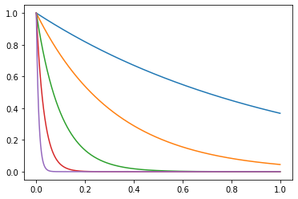
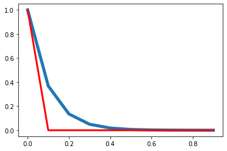
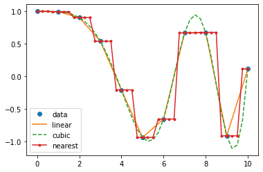
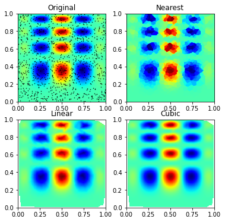
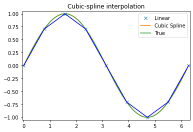
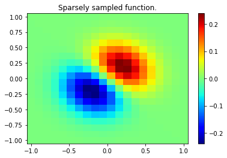
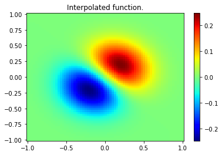
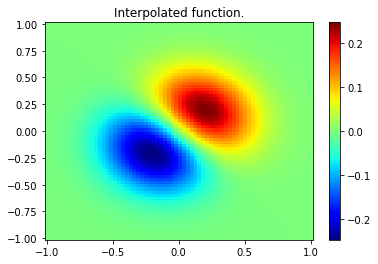
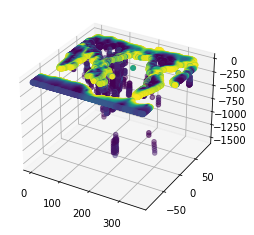

# Numerical analysis

<div class="questions">  
### Questions

- What computational/numercal techniques can be performed in Python?
- What tools are availble for analysis?
- How can I learn more information about my data?
</div>

<div class="objectives">  
### Objectives

- Generate a numerical model.
- Interpolate missing data.
- Run the scikit-learn k-means algorithm.
- Plot 3D data.
</div>

## Numerical models

We start with the numerical solution of a very simple differential
equation. In fact we choose something simple enough that we already 
know the answer.

\\[
        \frac{d\theta}{dt} = - k \theta
\\]

This is the equation which governs radioactive decay, in which case
\\(\theta \\) is the amount of the radioactive isotope remaining and \\(d\theta /  dt\\)
is the activity that we can measure. \\(k \\) is closely related to the half life.

The solution to this equation is
\\[
        \theta(t) = \theta_0 e^{-kt}
\\]

where \\(\theta_0\\) is the amount of the radioactive material remaining.
The same equation also describes the cooling of, say, a cup of coffee. In this
case we interpret \\( \theta \\) as the excess temperature (above room temperature). 


```python
%pylab inline

import numpy as np
import matplotlib.pyplot as plt

#Set the amount of isotope remaining (i.e. 1=100%)
theta_0 = 1.0

#Create a regularly spaced vector or time values
time_values = np.linspace(0,1.0,1000)

#Try several different values for the half-life, k
for const_k in [1.0, 3.1, 10.0, 31, 100.0]:
    #This is the solution to the decay equation, how much isotope remains.
    exact_theta_values = theta_0 * np.exp(-const_k * time_values)
    #Plot the results for different k values
    plt.plot(time_values, exact_theta_values)
```

    Populating the interactive namespace from numpy and matplotlib


    

    


We want to be able to march forward in time from our starting point
(just like the picture above)
where $\theta = \theta_0$ to obtain the value of $\theta$ at
later times. To do this, we need to approximate the original
differential equation, and, in particular, the value of the time
derivative at each time. There are a number of ways to do this.

### First order numerical approximation

Assume that the variation in \\(\theta(t) \\) is linear, i.e.
\\[
    \theta(t') = \theta_n + \beta t'
\\]

where we use a local time coordinate \\(t' = t - n\Delta t\\), so that when we differentiate

\\[
        \frac{d \theta}{dt} = \beta
\\]

To determine the approximation for the derivative therefore
becomes the solution to the following equation:

\\[
        \begin{split}
            & \theta_{n+1} = \theta_n + \beta \Delta t \\ \\
            & \Rightarrow	\beta = \frac{d \theta}{dt} = \frac{\theta_{n+1} - \theta_n}{\Delta t}
        \end{split}
\\]

This is a first order difference expression for the derivative which we
substitute into the original differential equation for radioactive decay at
the current timestep

\\[
        \frac{\theta_{n+1} - \theta_n}{\Delta t} = - k \theta_n
\\]

This rearranges to give us a time-marching algorithm:

\\[
        \theta_{n+1} = \theta_n (1-k \Delta t)
\\]

It is an indication of the fact that this problem is really not all that difficult
that this difference equation can be written recursively
to give:
\\[
        \theta_{n+1} = \theta_0 (1-k \Delta t)^n
\\]

In a moment we will compute some values for this expression to see how
accurate it is. First we consider whether we can improve the accuracy of the
approximation by doing a bit more work.


```python
#Set the known constant values
theta_0 = 1.0
const_k = 10.0
#How many timesteps to solve
steps = 10
delta_t = 1.0 / steps

#Create an empty array to store the solutions
theta_values = np.zeros(steps)
time_values  = np.zeros(steps)

#Set the starting values
theta_values[0] = theta_0
time_values[0] = 0.0

#Step through the time values
for i in range(1, steps):
    #Find the value for theta at this time step
    theta_values[i] = theta_values[i-1] * (1 - const_k * delta_t)
    #Update the time step
    time_values[i] = time_values[i-1] + delta_t

#Compare with the exact solution
exact_theta_values = theta_0 * np.exp(-const_k * time_values)

#Plot and compare your results
plt.plot(time_values, exact_theta_values, linewidth=5.0)
plt.plot(time_values, theta_values, linewidth=3.0, color="red")

```


    [<matplotlib.lines.Line2D at 0x1fcd301d888>]


    

    


### Higher order expansion

First we try fitting the local expansion for \\(\theta\\) through an
additional point.	 
This time we assume that the variation in \\(\theta(t)\\) is quadratic, i.e.
$$
    \theta(t') = \theta_{n-1} + \beta t' + \gamma {t'}^2
$$

The local time coordinate is $t' = t - (n-1)\Delta t$, and when we differentiate

$$       
    \frac{d \theta}{dt} = \beta + 2 \gamma t'
$$  

To solve for \\(\beta\\) and \\(\gamma\\) we fit the curve through the sample points:
$$
    \begin{split}
            \theta_n &= \theta_{n-1} + \beta \Delta t + \gamma (\Delta t)^2 \\
            \theta_{n+1} &= \theta_{n-1} + 2 \beta \Delta t + 4 \gamma (\Delta t)^2
     \end{split}
$$

Which solve to give
$$
     \begin{split}
     \beta &= \left( 4 \theta_n - \theta_{n+1} - 3\theta_{n-1} \right) \frac{1}{2\Delta t} \\
     \gamma &= \left( \theta_{n+1} + \theta_{n-1} -2 \theta_n \right) \frac{1}{2\Delta t^2} 
     \end{split}
$$

We can subsitute this back into the equation above and then into the original differential equation and we obtain the following

$$	 	
     \left. \frac{d\theta}{dt} \right|_{t=n\Delta t} = \beta + 2\gamma \Delta t =
     \frac{1}{2\Delta t} \left( \theta_{n+1} - \theta_{n-1} \right)  = -k \theta_n 
$$

The difference approximation to the derivative turns out to be the average of the expressions for the previous derivative and the new derivative. We have now included information about the current timestep and the previous timestep in our expression for the value of \\(\theta\\) at the forthcoming timestep:	

$$
     \theta_{n+1} = \theta_{n-1} -2k \theta_n \Delta t
$$

<div class="challenge">

### Challenge

- Can you implement the 2nd order Numerical Solution in Python?
Start as before:

```python
steps = 10
theta_0 = 1.0
const_k = 10.0
delta_t = 1.0 / steps

theta_values = np.zeros(steps)
time_values  = np.zeros(steps)

theta_values[0] = theta_0
time_values[0] = 0.0
    
theta_values[1] = ???
time_values[1] = ???
    
for i in range(1, steps):
    theta_values[i] = ???
    time_values[i] = ???

exact_theta_values = theta_0 * np.exp(-const_k * time_values)
    
plt.plot(time_values, exact_theta_values, linewidth=5.0)
plt.plot(time_values, theta_values, linewidth=3.0, color="red")
```

<details>
<summary>Solution</summary>

This is my solution
    
```python
steps = 10
theta_0 = 1.0
const_k = 10.0
delta_t = 1.0 / steps

theta_values = np.zeros(steps)
time_values  = np.zeros(steps)

theta_values[0] = theta_0
time_values[0] = 0.0

theta_values[1] = theta_values[0] * (1 - const_k * delta_t)
time_values[1] = delta_t

for i in range(2, steps):
    theta_values[i] = theta_values[i-2] - 2.0 * theta_values[i-1] * const_k * delta_t
    time_values[i] = time_values[i-1] + delta_t

exact_theta_values = theta_0 * np.exp(-const_k * time_values)
    
plot(time_values, exact_theta_values, linewidth=5.0)
plot(time_values, theta_values, linewidth=3.0, color="red")
```

</details>
</div>


## `scipy.interpolate`

This module provides general interpolation capability for data in 1, 2, and higher dimensions. This list of features is from the documentation:

  - A class representing an interpolant (interp1d) in 1-D, offering several interpolation methods.

  - Convenience function griddata offering a simple interface to interpolation in N dimensions (N = 1, 2, 3, 4, ...).     Object-oriented interface for the underlying routines is also available.
  
  - Functions for 1- and 2-dimensional (smoothed) cubic-spline interpolation, based on the FORTRAN library FITPACK.       There are both procedural and object-oriented interfaces for the FITPACK library.
  
  - Interpolation using Radial Basis Functions.


```python
%matplotlib inline
import matplotlib.pyplot as plt
import numpy as np
```

### 1D data 


```python
from scipy.interpolate import interp1d
```


```python
x = np.linspace(0, 10, num=11, endpoint=True)
y = np.cos(-x**2/9.0)
f = interp1d(x, y, kind='linear') # default if kind=None
f2 = interp1d(x, y, kind='cubic')
f3 = interp1d(x, y, kind='nearest')
```


```python
xnew = np.linspace(0, 10, num=41, endpoint=True)
plt.plot(x, y, 'o', xnew, f(xnew), '-', xnew, f2(xnew), '--', xnew, f3(xnew), '.-')
plt.legend(['data', 'linear', 'cubic', 'nearest'], loc='best')
plt.show()
```


    

    


## nD data

There are fewer approaches to n-dimensional data, the evaluation for arbitrary dimensions is always for points on an n dimensional grid.


```python
from scipy.interpolate import griddata

def func(x, y):
    return x*(1-x)*np.cos(4*np.pi*x) * np.sin(4*np.pi*y**2)**2
```


```python
# A regular grid array of x,y coordinates

grid_x, grid_y = np.mgrid[0:1:100j, 0:1:200j] # see np.info(np.mgrid) for an explanation of the 200j !!
```


```python
np.info(np.mgrid)
```

    `nd_grid` instance which returns a dense multi-dimensional "meshgrid".
    
    An instance of `numpy.lib.index_tricks.nd_grid` which returns an dense
    (or fleshed out) mesh-grid when indexed, so that each returned argument
    has the same shape.  The dimensions and number of the output arrays are
    equal to the number of indexing dimensions.  If the step length is not a
    complex number, then the stop is not inclusive.
    
    However, if the step length is a **complex number** (e.g. 5j), then
    the integer part of its magnitude is interpreted as specifying the
    number of points to create between the start and stop values, where
    the stop value **is inclusive**.
    
    Returns
    ----------
    mesh-grid `ndarrays` all of the same dimensions
    
    See Also
    --------
    numpy.lib.index_tricks.nd_grid : class of `ogrid` and `mgrid` objects
    ogrid : like mgrid but returns open (not fleshed out) mesh grids
    r_ : array concatenator
    
    Examples
    --------
    >>> np.mgrid[0:5,0:5]
    array([[[0, 0, 0, 0, 0],
            [1, 1, 1, 1, 1],
            [2, 2, 2, 2, 2],
            [3, 3, 3, 3, 3],
            [4, 4, 4, 4, 4]],
           [[0, 1, 2, 3, 4],
            [0, 1, 2, 3, 4],
            [0, 1, 2, 3, 4],
            [0, 1, 2, 3, 4],
            [0, 1, 2, 3, 4]]])
    >>> np.mgrid[-1:1:5j]
    array([-1. , -0.5,  0. ,  0.5,  1. ])


```python
# A random sampling within the same area
points = np.random.rand(1000, 2)
values = func(points[:,0], points[:,1])

# Resample from the values at these points onto the regular mesh
grid_z0 = griddata(points, values, (grid_x, grid_y), method='nearest')
grid_z1 = griddata(points, values, (grid_x, grid_y), method='linear')
grid_z2 = griddata(points, values, (grid_x, grid_y), method='cubic')
```


```python
plt.subplot(221)
plt.imshow(func(grid_x, grid_y).T, extent=(0,1,0,1), origin='lower', cmap='jet')
plt.plot(points[:,0], points[:,1], 'k.', ms=1)
plt.title('Original')
plt.subplot(222)
plt.imshow(grid_z0.T, extent=(0,1,0,1), origin='lower', cmap='jet')
plt.title('Nearest')
plt.subplot(223)
plt.imshow(grid_z1.T, extent=(0,1,0,1), origin='lower', cmap='jet')
plt.title('Linear')
plt.subplot(224)
plt.imshow(grid_z2.T, extent=(0,1,0,1), origin='lower', cmap='jet')
plt.title('Cubic')
plt.gcf().set_size_inches(6, 6)
plt.show()
```


    

    


## Splines 

Which have the added benefit of giving smooth derivative information


```python
from scipy.interpolate import splrep, splev
```


```python
x = np.arange(0, 2*np.pi+np.pi/4, 2*np.pi/8)
y = np.sin(x)
tck = splrep(x, y, s=0)
xnew = np.arange(0, 2*np.pi, np.pi/50)
ynew = splev(xnew, tck, der=0)
yder = splev(xnew, tck, der=1)
```


```python
plt.figure()
plt.plot(x, y, 'x', xnew, ynew, xnew, np.sin(xnew), x, y, 'b')
plt.legend(['Linear', 'Cubic Spline', 'True'])
plt.axis([-0.05, 6.33, -1.05, 1.05])
plt.title('Cubic-spline interpolation')
plt.show()
```


    

    


```python
plt.figure()
plt.plot(xnew, yder, xnew, np.cos(xnew),'--')
plt.legend(['Cubic Spline', 'True'])
plt.axis([-0.05, 6.33, -1.05, 1.05])
plt.title('Derivative estimation from spline')
plt.show()
```


    

    


__2D splines__ are also available


```python
from scipy.interpolate import bisplrep, bisplev

# Gridded function (at low resolution ... doesn't need to be gridded data here)

x, y = np.mgrid[-1:1:20j, -1:1:20j]
z = (x+y) * np.exp(-6.0*(x*x+y*y))

plt.figure()
plt.pcolor(x, y, z, cmap='jet',shading='auto')
plt.colorbar()
plt.title("Sparsely sampled function.")
plt.show()
```


    

    


```python
xnew, ynew = np.mgrid[-1:1:70j, -1:1:70j]

## Create the spline-representation object tck

tck = bisplrep(x, y, z, s=0)
znew = bisplev(xnew[:,0], ynew[0,:], tck)
```


```python
plt.figure()
plt.pcolor(xnew, ynew, znew, cmap='jet',shading='auto')
plt.colorbar()
plt.title("Interpolated function.")
plt.show()
```


    

    


### See also

  - Radial basis function interpolation for scattered data in n dimensions (slow for large numbers of points): `from scipy.interpolate import Rbf`
  - `scipy.ndimage` for fast interpolation operations on image-like arrays
  - B-splines on regular arrays are found in the `scipy.signal` module
 

## Clustering data with scikit-learn

Here we want to explore a neat and efficient way of exploring a (seisimic tomography) dataset in Python. We will be using a Machine Learning algorithm known as [K-Means clustering](https://scikit-learn.org/stable/modules/clustering.html#k-means). 

Data is from: *Li, C., van der Hilst, R. D., Engdahl, E. R., and Burdick, S. (2008), A new global model for P wave speed variations in Earth's mantle, Geochem. Geophys. Geosyst., 9, Q05018, doi:10.1029/2007GC001806*


```python
from sklearn.cluster import KMeans
import numpy as np
import matplotlib.pyplot as plt 
from mpl_toolkits.mplot3d import Axes3D
```

Load in the tomography data set. Assign the column vectors to unique variables (for clarity).


```python
tomo=np.loadtxt('../data/ggge1202-sup-0002-ds01.txt', skiprows=1)

lat=tomo[:,0]
lon=tomo[:,1]
depth=tomo[:,2]
dvp=tomo[:,3]
```

Now run the clustering algorithm


```python
kmeans = KMeans(n_clusters=5, random_state=0).fit(dvp.reshape(-1, 1))

#When completed, check the clusters the algorithm has identified.
print(kmeans.cluster_centers_)
```

    [[-0.03368738]
     [ 3.92812009]
     [ 0.27602101]
     [ 1.8442656 ]
     [-0.2770305 ]]


Note, many functions have been "parallelised" and tuned to best take advantage of your computer, see e.g. for more details [https://scikit-learn.org/stable/modules/computing.html#parallelism](https://scikit-learn.org/stable/modules/computing.html#parallelism)

You can have a look what the labels look like. It is essentially a vector the same length as the data indicating which label it has classified.


```python
kmeans.labels_
```


    array([3, 3, 3, ..., 0, 0, 0])


Choose one of the clusters to visualise, so subset the data into new vectors accordingly


```python
centre=1

latClust=lat[kmeans.labels_==centre]
lonClust=lon[kmeans.labels_==centre]
depthClust=depth[kmeans.labels_==centre]
dvpClust=dvp[kmeans.labels_==centre]
```

Finally, plot the results!


```python
fig = plt.figure()
ax = fig.add_subplot(111, projection='3d')
ax.scatter(lon, lat, -depth, c=dvp)
```


    <mpl_toolkits.mplot3d.art3d.Path3DCollection at 0x1fcd3c8c1c8>


    

    


<div class="keypoints">
### Key points

- You can use Python to solve math equations
- scipy for interpolation
- sklearn for clustering
- New ways to plot data
- Read the docs to learn more
</div>
