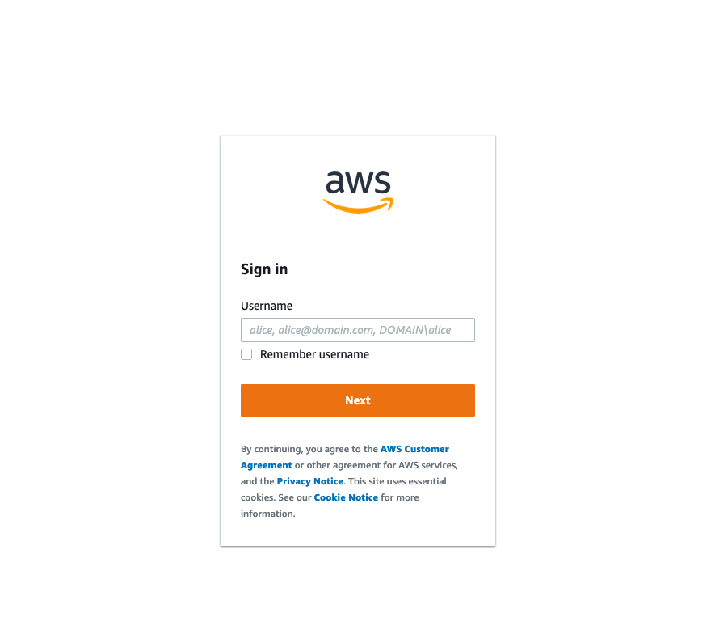
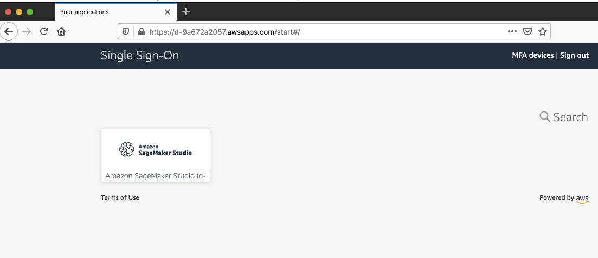
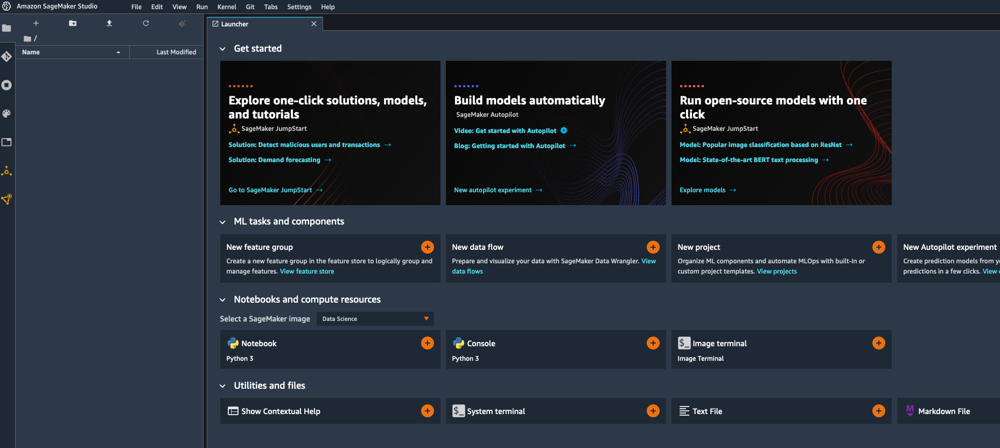
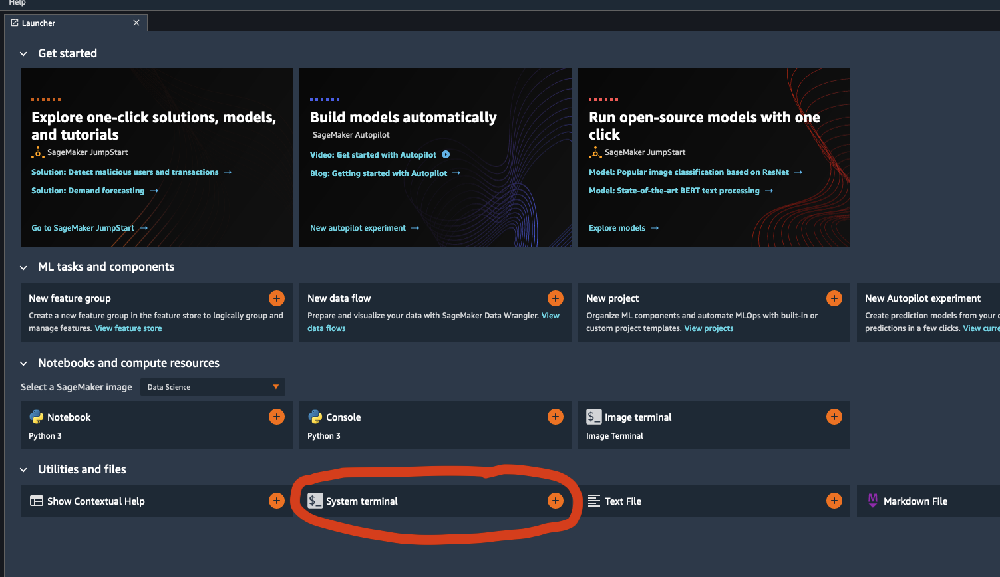
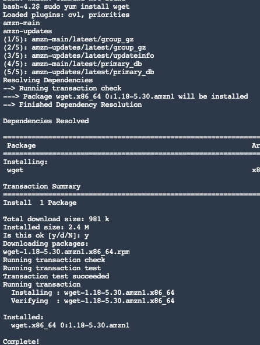
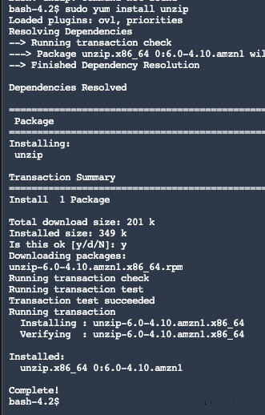
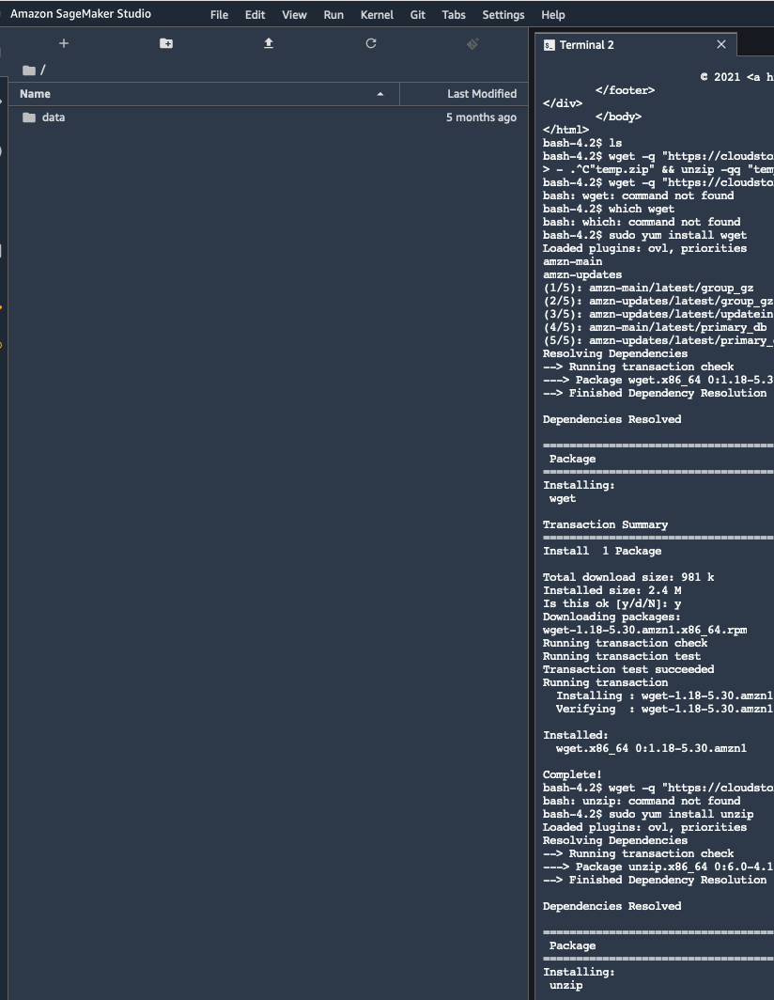
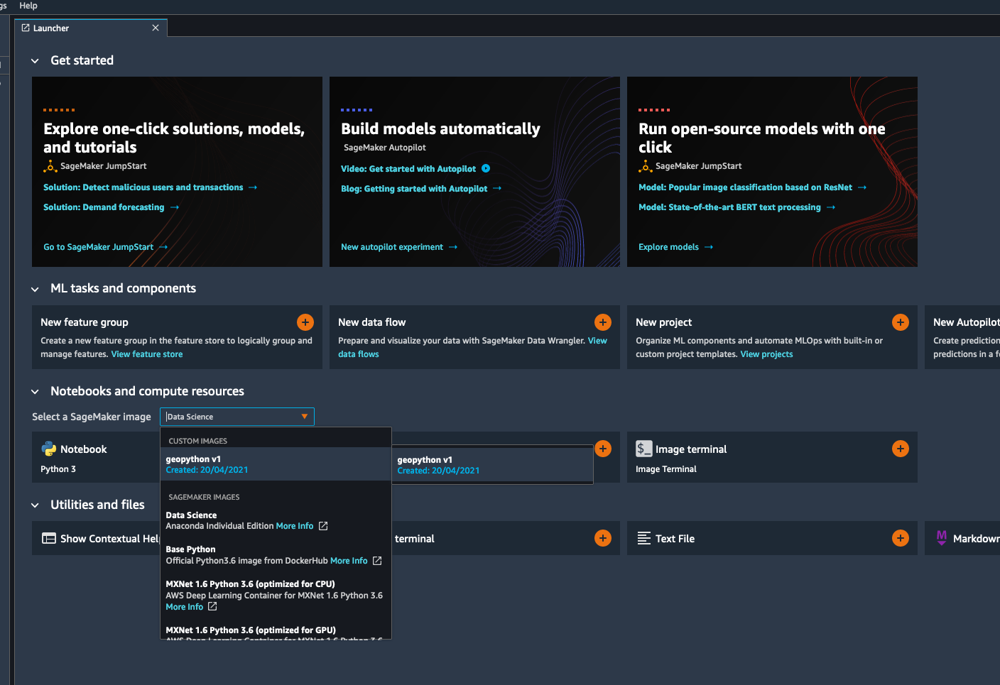
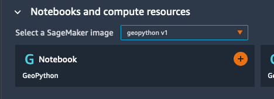
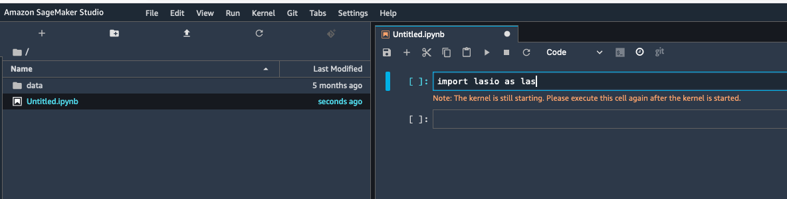

## Getting onto our backup platform - AWS Sagemaker


If you're reading this page it means we can't quite debug your software installation at the moment. Please:

1. Don't panic
2. Plan to hang around a few minutes after class, if possible, or shoot us an email to let us know when we can Zoom-base with you for ~20 minutes before the next session to fix the install
3. Follow the instructions below to get onto our backup platform and continue from where you left off

***

### Step 1

1. Go to [this](https://d-9a672a2057.awsapps.com/start) URL.
2. Sign in using the credentials you created, i.e. your username and password.



3. After logging in, you should see something like this. Click on the Amazon SageMaker Studio button. This may take a few minutes to load.

   

   


4. Eventually, you will see an interface that looks like this:




In order to proceed with the workshop, you'll need to do two things: (1) get the data /once during the course of all of our training/, and (2) launch the correct version of python.

## Getting the data

First, we'll need to get the data. 

1. Click the system terminal box




2. Copy the following commands into the command prompt that appears.

```sh
# this will install wget
sudo yum install wget
```

Type "y" when the command prompt hangs and asks you the question: "Is this ok? [y/d/N]"



The above should happen.

Then copy 

```sh
sudo yum install unzip
```

To install the unzip command, and (again after saying "y" to the prompt) the following should happen:



Finally, type the following command to get our data:

```sh
wget -q "https://cloudstor.aarnet.edu.au/plus/s/IfOvRpOXhJyqTT0/download" -O "data.zip" && unzip -qq "data.zip" && rm -rf "data.zip"
```

This should result in a folder with your data becoming visible in the panel on the left:



## Launching the correct python environment

Next, you need to launch the correct python environment that has all of the packages we'll need. To do this, close the terminal tab, and you'll automatically see the central dashboard we did before. Click on `Select a SageMaker Image` and choose `geopython v1` as shown in the image below:



Then click on the GNotebook button to launch a new jupyter notebook instance



You may need to wait a few seconds, after which the kernel will be working and you should be able to continue with the workshop. Note that you may need to import libraries again if we have already done so in class.


