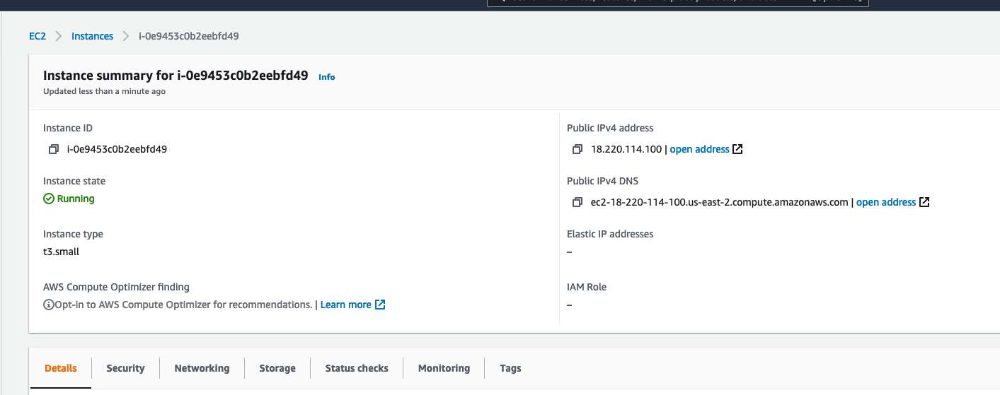

## Instructor instructions - setting up Jupyterhub on AWS


The first steps are adapted from TLJH instuctions [here](https://tljh.jupyter.org/en/latest/install/amazon.html)

1. Select a **Ubuntu Server 18.04 LTS (HVM), SSD Volume Type - ami-** instance (the one maintained by Canonical as per the TLJH screenshots in the documentation)

2. Choose a **t3.small** node type for testing - it's the smallest that supports TLJH. Note that this does not have a free tier, but running it for a few hours costs approximately $0.10 in my experience.

   For "production" PESA try `m5a.8xlarge` in US-Ohio (this gives 32 vCPU and 128 Gb RAM).

In theory, you are meant to be able to use a custom command to install TLJH in one go, and paste it into the user script box. Unfortunately, none of the flags have worked for me, and the installation script itself sometimes works and sometimes doesn't - so I recommend doing this over the ssh after the instance has been created.

```sh
#!/bin/bash
curl -L https://tljh.jupyter.org/bootstrap.py \
  | sudo python3 - \
    --admin myusername --show-progress-page --plugin tljh-repo2docker # can also in theory use a requirements.txt file here
```

3. When selecting storage, request General Purpose SSD (gp2) for most workloads; according to TLJH Provisioned IOPS SSD (io1) is the highest-performant when performance is critical. I have only used gp2 so far.

4. [Only the first time you set up] After downloading the AWS `.pem` file, make sure to `chmod 600` it as otherwise you get a permissions error.

```sh
chmod 600 ~/Desktop/pesaaws1.pem
```

### 

### Installing TLJH

1. `ssh` into the server via the Public IPv4 DNS provided in the instance details. `ubuntu` is the admin username for the root ubuntu user, and you'll need root privileges for the below

```sh
ssh -i ~/Desktop/pesaaws1.pem ubuntu@ec2-18-220-114-100.us-east-2.compute.amazonaws.com
```




2. Install TLJH using the following command

```sh
curl -L https://tljh.jupyter.org/bootstrap.py \
  | sudo python3 - \
    --admin myusername #--user-requirements-txt-url https://raw.githubusercontent.com/data-8/materials-sp18/master/requirements.txt
```

3. 

### Getting the data and notebooks - do this BEFORE creating users

Create a folder as recommended [in these instructions](https://tljh.jupyter.org/en/latest/howto/content/share-data.html#howto-content-share-data)

```sh
sudo mkdir -p /srv/
# you may need to chmod it but I can't figure out the optimal permissions
# sudo chmod 777 data
```

Open a terminal on your **local machine** and upload the data to the AWS machine with the following command:

```sh
sudo scp -r -i ~/Desktop/pesaaws1.pem * ubuntu@ec2-3-141-195-91.us-east-2.compute.amazonaws.com:/srv/data/
```

To grab from **cloudstor** (recommended):

```sh
cd /srv/
sudo wget https://cloudstor.aarnet.edu.au/plus/s/62la9C8dn5vjAaa/download
sudo apt-get install -y unzip
sudo unzip download
```

Then create a soft link to the data directory with the following command. 

```sh
sudo ln -s /srv/geopython/data /etc/skel/data
sudo ln -s /srv/geopython/notebooks /etc/skel/notebooks
```

It should now be visible for any new user created. 


**The geopython workshop also requires graphviz**

```sh
sudo apt install graphviz
```

## Installing packages


Install the packages you need into the base environment.

We use the Anaconda package manager for our training, and share installation instructions using a conda `environment.yml` file. If you instead have a pip requirements.txt file, you could have used the `--user-requirements-txt-url` flag at the end of the TLJH install above to install all of the packages in one go.

Modify the base conda environment for all users:

```sh
export PATH=/opt/tljh/user/bin:${PATH}
sudo -E conda env update -n base -f /srv/geopython/environment.yml
```


## Adding users

Launch the jupyterhub by following the Public IPv4 address indicated for the EC2 instance, changing the https: at the beginning of the url to http:

Ignoring the unsecurity warnings, log in using the administrator login and a random password (make sure to write this down) to see the jupyter hub.

Go to the Control Panel -> Admin interface and click the `Add Users` button.

Manually paste usernames you'd like into the box.

***

Notes on getting our specific notebooks to work

```python
#Import dask dataframe modules
import dask.dataframe as dd
#NOTE: to run this example (with diagrams) you will need to "pip install graphviz" and donwload graphviz
#https://graphviz.org/download/
import os
# Nate has the below; replace
#os.environ["PATH"] += os.pathsep + 'C:/APPS/Graphviz/bin'
os.chdir('/home/jupyter-user8/')
# may need to replace data file to dd.read_csv("data/ml_data_points.csv")
```


Note: mpi example at end of notebook 4 will not work

***

### Using cloudwatch agent to monitor usage

Needed to create an IAM role as describe [here](https://docs.aws.amazon.com/AmazonCloudWatch/latest/monitoring/create-iam-roles-for-cloudwatch-agent.html) once

