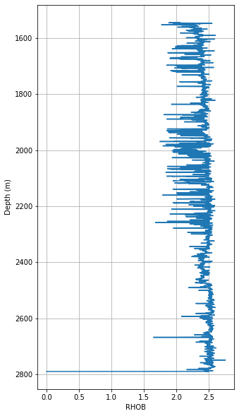
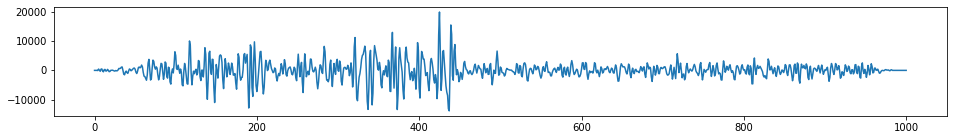
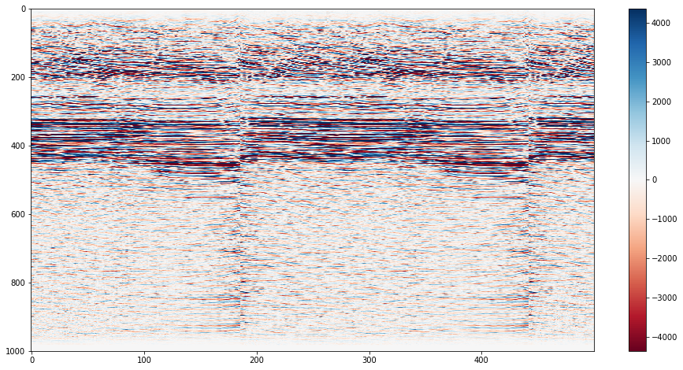

## Dealing with other data types
Python can deal with basically any type of data you throw at it. The community have provided many packages that make things easy, today we will look at the "pyshp" (for dealing with shapefiles) and "pandas" (great for tables and time series) packages.

Data for this exercised was downloaded from http://www.bom.gov.au/water/groundwater/explorer/map.shtml

# Shapefiles
Shapefiles are a very common file format for GIS data.


```python
#Load the required modules
import shapefile

#NOTE: Weirdly and confusingly, this package is called "pyshp" but you call it via the name "shapefile"
```


```python
help(shapefile)
#Or check out the help pages https://github.com/GeospatialPython/pyshp
```

    Help on module shapefile:
    
    NAME
        shapefile
    
    FILE
    ...
    


```python
#Set the filename
boreshape='../data/shp_torrens_river/NGIS_BoreLine.shp'

#read in the file
shapeRead = shapefile.Reader(boreshape)

#And save out some of the shape file attributes
recs    = shapeRead.records()
shapes  = shapeRead.shapes()
fields  = shapeRead.fields
Nshp    = len(shapes)
```


```python
print(Nshp) #print the Number of items in the shapefile
```

    7635


```python
fields[:]#print the fields
```


    [('DeletionFlag', 'C', 1, 0),
     ['HydroID', 'N', 10, 0],
     ['HydroCode', 'C', 30, 0],
     ['BoreID', 'N', 10, 0],
     ['TopElev', 'F', 19, 11],
     ['BottomElev', 'F', 19, 11],
     ['HGUID', 'N', 10, 0],
     ['HGUNumber', 'N', 10, 0],
     ['NafHGUNumb', 'N', 10, 0],
     ['SHAPE_Leng', 'F', 19, 11]]


```python
recs[0] #print the first record, then this is a list that can be subscripted further
```


    [32001999, '652800645', 30027773, 6.74, -74.26, 31000043, 1042, 104005, 0.0]


```python
shapes[0].points #print the point values of the first shape
```


    [(591975.5150000006, -3816141.8817), (591975.5150000006, -3816141.8817)]


Shapefiles are not a native python format, but the community have developed tools for exploring them. The package we have used "pyshp" imported with the name "shapefile" (for some non-consistent weird reason), is one example of working with shapefiles. Alternatives exist.

## More table manipulation


```python
#Import the module
import pandas
```


```python
#read in the data
log_data=pandas.read_csv("../data/shp_torrens_river/NGIS_LithologyLog.csv",\
                         header=0,sep=',',skipinitialspace=True,quotechar ='"',\
                         usecols=list(range(0,13)),\
                         skiprows=[453,456,458,460,689,697,720,723,726,839,880,884,885,890,898,934])

#This data was weird because it has quotation marks to signify inches inside comments within the file, 
#making automatic reading of it tricky
```


```python
log_data           # print the first 30 and last 30 rows
```


<div>
<style scoped>
    .dataframe tbody tr th:only-of-type {
        vertical-align: middle;
    }

    .dataframe tbody tr th {
        vertical-align: top;
    }

    .dataframe thead th {
        text-align: right;
    }
</style>
<table border="1" class="dataframe">
  <thead>
    <tr style="text-align: right;">
      <th></th>
      <th>OBJECTID</th>
      <th>BoreID</th>
      <th>HydroCode</th>
      <th>RefElev</th>
      <th>RefElevDesc</th>
      <th>FromDepth</th>
      <th>ToDepth</th>
      <th>TopElev</th>
      <th>BottomElev</th>
      <th>MajorLithCode</th>
      <th>MinorLithCode</th>
      <th>Description</th>
      <th>Source</th>
    </tr>
  </thead>
  <tbody>
    <tr>
      <th>0</th>
      <td>1769789</td>
      <td>30062892</td>
      <td>662815923</td>
      <td>57.25</td>
      <td>NGS</td>
      <td>18.0</td>
      <td>19.5</td>
      <td>39.25</td>
      <td>37.75</td>
      <td>CLYU</td>
      <td>None</td>
      <td>Clay</td>
      <td>SAGeodata</td>
    </tr>
    <tr>
      <th>1</th>
      <td>1769790</td>
      <td>30062892</td>
      <td>662815923</td>
      <td>57.25</td>
      <td>NGS</td>
      <td>19.5</td>
      <td>22.0</td>
      <td>37.75</td>
      <td>35.25</td>
      <td>ROCK</td>
      <td>None</td>
      <td>Rocks and sand</td>
      <td>SAGeodata</td>
    </tr>
    <tr>
      <th>2</th>
      <td>1769791</td>
      <td>30062892</td>
      <td>662815923</td>
      <td>57.25</td>
      <td>NGS</td>
      <td>22.0</td>
      <td>24.0</td>
      <td>35.25</td>
      <td>33.25</td>
      <td>CLYU</td>
      <td>None</td>
      <td>Clay</td>
      <td>SAGeodata</td>
    </tr>
    <tr>
      <th>3</th>
      <td>1770725</td>
      <td>30141910</td>
      <td>662816624</td>
      <td>4.0</td>
      <td>NGS</td>
      <td>0.0</td>
      <td>6.0</td>
      <td>4.0</td>
      <td>-2.0</td>
      <td>None</td>
      <td>None</td>
      <td>No sample</td>
      <td>SAGeodata</td>
    </tr>
    <tr>
      <th>...</th>
      <td>...</td>
      <td>...</td>
      <td>...</td>
      <td>...</td>
      <td>...</td>
      <td>...</td>
      <td>...</td>
      <td>...</td>
      <td>...</td>
      <td>...</td>
      <td>...</td>
      <td>...</td>
      <td>...</td>
    </tr>
    <tr>
      <th>70154</th>
      <td>4120347</td>
      <td>30304050</td>
      <td>652802882</td>
      <td>None</td>
      <td>UNK</td>
      <td>0.0</td>
      <td>0.3</td>
      <td>None</td>
      <td>None</td>
      <td>FILL</td>
      <td>None</td>
      <td>Fill</td>
      <td>SAGeodata</td>
    </tr>
    <tr>
      <th>70155</th>
      <td>4120348</td>
      <td>30304050</td>
      <td>652802882</td>
      <td>None</td>
      <td>UNK</td>
      <td>0.3</td>
      <td>0.8</td>
      <td>None</td>
      <td>None</td>
      <td>SAND</td>
      <td>None</td>
      <td>Clayey sand</td>
      <td>SAGeodata</td>
    </tr>
    <tr>
      <th>70156</th>
      <td>4120349</td>
      <td>30304050</td>
      <td>652802882</td>
      <td>None</td>
      <td>UNK</td>
      <td>0.8</td>
      <td>3.5</td>
      <td>None</td>
      <td>None</td>
      <td>SAND</td>
      <td>None</td>
      <td>Sand</td>
      <td>SAGeodata</td>
    </tr>
  </tbody>
</table>
<p>70157 rows × 13 columns</p>
</div>


```python
# add a new column as a function of existing columns
log_data['Thickness'] = log_data.ToDepth - log_data.FromDepth
```


```python
type(log_data)     # see what Python type the DataFrame is
```


    pandas.core.frame.DataFrame


```python
log_data.head(3)    # print the first 3 rows
```


<div>
<style scoped>
    .dataframe tbody tr th:only-of-type {
        vertical-align: middle;
    }

    .dataframe tbody tr th {
        vertical-align: top;
    }

    .dataframe thead th {
        text-align: right;
    }
</style>
<table border="1" class="dataframe">
  <thead>
    <tr style="text-align: right;">
      <th></th>
      <th>OBJECTID</th>
      <th>BoreID</th>
      <th>HydroCode</th>
      <th>RefElev</th>
      <th>RefElevDesc</th>
      <th>FromDepth</th>
      <th>ToDepth</th>
      <th>TopElev</th>
      <th>BottomElev</th>
      <th>MajorLithCode</th>
      <th>MinorLithCode</th>
      <th>Description</th>
      <th>Source</th>
      <th>Thickness</th>
    </tr>
  </thead>
  <tbody>
    <tr>
      <th>0</th>
      <td>1769789</td>
      <td>30062892</td>
      <td>662815923</td>
      <td>57.25</td>
      <td>NGS</td>
      <td>18.0</td>
      <td>19.5</td>
      <td>39.25</td>
      <td>37.75</td>
      <td>CLYU</td>
      <td>None</td>
      <td>Clay</td>
      <td>SAGeodata</td>
      <td>1.5</td>
    </tr>
    <tr>
      <th>1</th>
      <td>1769790</td>
      <td>30062892</td>
      <td>662815923</td>
      <td>57.25</td>
      <td>NGS</td>
      <td>19.5</td>
      <td>22.0</td>
      <td>37.75</td>
      <td>35.25</td>
      <td>ROCK</td>
      <td>None</td>
      <td>Rocks and sand</td>
      <td>SAGeodata</td>
      <td>2.5</td>
    </tr>
    <tr>
      <th>2</th>
      <td>1769791</td>
      <td>30062892</td>
      <td>662815923</td>
      <td>57.25</td>
      <td>NGS</td>
      <td>22.0</td>
      <td>24.0</td>
      <td>35.25</td>
      <td>33.25</td>
      <td>CLYU</td>
      <td>None</td>
      <td>Clay</td>
      <td>SAGeodata</td>
      <td>2.0</td>
    </tr>
  </tbody>
</table>
</div>


```python
log_data.index     # “the index” (aka “the labels”). 
#Pandas is great for using timeseries data, where the index can be the timestamps
```


    RangeIndex(start=0, stop=70157, step=1)


```python
log_data.columns   # column names (which is “an index”)
```


    Index([u'OBJECTID', u'BoreID', u'HydroCode', u'RefElev', u'RefElevDesc',
           u'FromDepth', u'ToDepth', u'TopElev', u'BottomElev', u'MajorLithCode',
           u'MinorLithCode', u'Description', u'Source', u'Thickness'],
          dtype='object')


```python
log_data.dtypes    # data types of each column
```


    OBJECTID           int64
    BoreID             int64
    HydroCode          int64
    RefElev           object
    RefElevDesc       object
    FromDepth        float64
    ToDepth          float64
    TopElev           object
    BottomElev        object
    MajorLithCode     object
    MinorLithCode     object
    Description       object
    Source            object
    Thickness        float64
    dtype: object


```python
log_data.shape     # number of rows and columns
```


    (70157, 14)


```python
log_data.values    # underlying numpy array — df are stored as numpy arrays for efficiencies.
```


    array([[1769789L, 30062892L, 662815923L, ..., 'Clay', 'SAGeodata', 1.5],
           [1769790L, 30062892L, 662815923L, ..., 'Rocks and sand',
            'SAGeodata', 2.5],
           [1769791L, 30062892L, 662815923L, ..., 'Clay', 'SAGeodata', 2.0],
           ...,
           [4120347L, 30304050L, 652802882L, ..., 'Fill', 'SAGeodata', 0.3],
           [4120348L, 30304050L, 652802882L, ..., 'Clayey sand', 'SAGeodata',
            0.5],
           [4120349L, 30304050L, 652802882L, ..., 'Sand', 'SAGeodata', 2.7]],
          dtype=object)


```python
#log_data['MajorLithCode']         # select one column
##Equivalent to 
#log_data.MajorLithCode 
##and
#log_data.iloc[:,9]
```


```python
type(log_data['MajorLithCode'])   # determine datatype of column (e.g., Series)
```


    pandas.core.series.Series


```python
#describe the data frame
log_data.describe(include='all')     
```


<div>
<style scoped>
    .dataframe tbody tr th:only-of-type {
        vertical-align: middle;
    }

    .dataframe tbody tr th {
        vertical-align: top;
    }

    .dataframe thead th {
        text-align: right;
    }
</style>
<table border="1" class="dataframe">
  <thead>
    <tr style="text-align: right;">
      <th></th>
      <th>OBJECTID</th>
      <th>BoreID</th>
      <th>HydroCode</th>
      <th>RefElev</th>
      <th>RefElevDesc</th>
      <th>FromDepth</th>
      <th>ToDepth</th>
      <th>TopElev</th>
      <th>BottomElev</th>
      <th>MajorLithCode</th>
      <th>MinorLithCode</th>
      <th>Description</th>
      <th>Source</th>
      <th>Thickness</th>
    </tr>
  </thead>
  <tbody>
    <tr>
      <th>count</th>
      <td>7.015700e+04</td>
      <td>7.015700e+04</td>
      <td>7.015700e+04</td>
      <td>70157</td>
      <td>70157</td>
      <td>70157.000000</td>
      <td>70157.000000</td>
      <td>70157</td>
      <td>70157</td>
      <td>70157</td>
      <td>70157</td>
      <td>70157</td>
      <td>70157</td>
      <td>70157.000000</td>
    </tr>
    <tr>
      <th>unique</th>
      <td>NaN</td>
      <td>NaN</td>
      <td>NaN</td>
      <td>5068</td>
      <td>4</td>
      <td>NaN</td>
      <td>NaN</td>
      <td>27777</td>
      <td>27878</td>
      <td>81</td>
      <td>42</td>
      <td>33598</td>
      <td>39</td>
      <td>NaN</td>
    </tr>
    <tr>
      <th>top</th>
      <td>NaN</td>
      <td>NaN</td>
      <td>NaN</td>
      <td>None</td>
      <td>NGS</td>
      <td>NaN</td>
      <td>NaN</td>
      <td>None</td>
      <td>None</td>
      <td>CLYU</td>
      <td>None</td>
      <td>Clay</td>
      <td>SAGeodata</td>
      <td>NaN</td>
    </tr>
    <tr>
      <th>freq</th>
      <td>NaN</td>
      <td>NaN</td>
      <td>NaN</td>
      <td>18514</td>
      <td>44946</td>
      <td>NaN</td>
      <td>NaN</td>
      <td>18514</td>
      <td>18514</td>
      <td>25857</td>
      <td>62797</td>
      <td>4603</td>
      <td>70119</td>
      <td>NaN</td>
    </tr>
    <tr>
      <th>mean</th>
      <td>2.505842e+06</td>
      <td>3.018201e+07</td>
      <td>6.624491e+08</td>
      <td>NaN</td>
      <td>NaN</td>
      <td>24.942443</td>
      <td>30.626594</td>
      <td>NaN</td>
      <td>NaN</td>
      <td>NaN</td>
      <td>NaN</td>
      <td>NaN</td>
      <td>NaN</td>
      <td>5.684151</td>
    </tr>
    <tr>
      <th>std</th>
      <td>9.276598e+05</td>
      <td>8.068098e+04</td>
      <td>2.130462e+06</td>
      <td>NaN</td>
      <td>NaN</td>
      <td>45.435866</td>
      <td>48.609957</td>
      <td>NaN</td>
      <td>NaN</td>
      <td>NaN</td>
      <td>NaN</td>
      <td>NaN</td>
      <td>NaN</td>
      <td>9.943264</td>
    </tr>
    <tr>
      <th>min</th>
      <td>1.769789e+06</td>
      <td>3.002715e+07</td>
      <td>6.528000e+08</td>
      <td>NaN</td>
      <td>NaN</td>
      <td>0.000000</td>
      <td>0.010000</td>
      <td>NaN</td>
      <td>NaN</td>
      <td>NaN</td>
      <td>NaN</td>
      <td>NaN</td>
      <td>NaN</td>
      <td>0.000000</td>
    </tr>
    <tr>
      <th>25%</th>
      <td>1.932799e+06</td>
      <td>3.014558e+07</td>
      <td>6.628129e+08</td>
      <td>NaN</td>
      <td>NaN</td>
      <td>0.800000</td>
      <td>4.000000</td>
      <td>NaN</td>
      <td>NaN</td>
      <td>NaN</td>
      <td>NaN</td>
      <td>NaN</td>
      <td>NaN</td>
      <td>1.000000</td>
    </tr>
    <tr>
      <th>50%</th>
      <td>1.999036e+06</td>
      <td>3.018487e+07</td>
      <td>6.628196e+08</td>
      <td>NaN</td>
      <td>NaN</td>
      <td>7.000000</td>
      <td>11.580000</td>
      <td>NaN</td>
      <td>NaN</td>
      <td>NaN</td>
      <td>NaN</td>
      <td>NaN</td>
      <td>NaN</td>
      <td>2.800000</td>
    </tr>
    <tr>
      <th>75%</th>
      <td>3.967159e+06</td>
      <td>3.025487e+07</td>
      <td>6.628248e+08</td>
      <td>NaN</td>
      <td>NaN</td>
      <td>25.900000</td>
      <td>34.750000</td>
      <td>NaN</td>
      <td>NaN</td>
      <td>NaN</td>
      <td>NaN</td>
      <td>NaN</td>
      <td>NaN</td>
      <td>7.000000</td>
    </tr>
    <tr>
      <th>max</th>
      <td>4.120349e+06</td>
      <td>3.030405e+07</td>
      <td>6.728042e+08</td>
      <td>NaN</td>
      <td>NaN</td>
      <td>610.300000</td>
      <td>620.160000</td>
      <td>NaN</td>
      <td>NaN</td>
      <td>NaN</td>
      <td>NaN</td>
      <td>NaN</td>
      <td>NaN</td>
      <td>300.500000</td>
    </tr>
  </tbody>
</table>
</div>


```python
# summarise a panda Series
log_data.FromDepth.describe()   # describe a single column
```


    count    70157.000000
    mean        24.942443
    std         45.435866
    min          0.000000
    25%          0.800000
    50%          7.000000
    75%         25.900000
    max        610.300000
    Name: FromDepth, dtype: float64


```python
#calculate mean of 5th column ("FromDepth")
log_data.iloc[:,5].mean()      
```


    24.9424428068475


```python
#alternate method to calculate mean of FromDepth column (the 5th one)
log_data["FromDepth"].mean()    
```


    24.9424428068475


```python
#Count how many Lith Codes there are
lithCounts=log_data.MajorLithCode.value_counts()
```


```python
#Print the lithcodes, use .index or .values 
lithCounts
```


    CLYU    25857
    SAND    12772
    SLAT     4069
    FILL     4020
    SDST     3207
    TPSL     2767
    GRVL     2445
    QTZT     1891
    SHLE     1601
    SCHT     1576
    ROCK     1572
    LMST     1571
    SILT     1436
    None      874
    SLST      530
    MDST      528
    STON      474
    SOIL      441
    QUAR      251
    BITM      205
    SPST      190
    SHEL      181
    DLOM      169
    LOAM      143
    CLYS      119
    CORL      117
    MARL      115
    GNSS       99
    RUBL       90
    UKN        82
            ...  
    BASE       13
    MANM       13
    PEAT       12
    TRAV       10
    COAL        8
    WKST        7
    BSLT        6
    CAAR        6
    PYRT        5
    SLAG        5
    GPSM        5
    CAVE        3
    WOOD        2
    PEGM        2
    CLYW        2
    CLYR        2
    VOLC        2
    OPCA        2
    CLLV        2
    HFLS        1
    ARKS        1
    ALDG        1
    DIOR        1
    LMSD        1
    DUST        1
    FOSS        1
    REGO        1
    SCOR        1
    CALU        1
    SANN        1
    Name: MajorLithCode, Length: 81, dtype: int64


```python
#plot a bar chart of the lith codes
lithCounts.plot.bar(rot=90,figsize=(15,5))
```


    <matplotlib.axes._subplots.AxesSubplot at 0x9f13990>


```python
#Plot a bar chart of the lith codes for the rarer lithologies
lithCounts[(lithCounts < 50)].plot.bar(rot=90,figsize=(15,5))
```


    <matplotlib.axes._subplots.AxesSubplot at 0xa410b70>


```python
import numpy as np
import matplotlib.mlab as mlab
import matplotlib.pyplot as plt
 
# example data
mu = np.mean(log_data['Thickness'].values) # mean of distribution
sigma = np.std(log_data['Thickness'].values) # standard deviation of distribution
x = log_data['Thickness'].values
# the histogram of the data
plt.hist(x, bins=[0,0.25,0.5,0.75,1.0,1.25,1.5,1.75,2,2.25,2.5,2.75,3.0], alpha=0.5)
plt.xlabel('Thickness (m)')
plt.ylabel('Count')
mystring="Histogram with a mean of "+ str(mu)
plt.title(mystring)
 
# Tweak spacing to prevent clipping of ylabel
#plt.subplots_adjust(left=0.15)
plt.show()


```


```python
# import numpy as np
# cmap = plt.get_cmap('viridis')
# colors = cmap(np.linspace(0, 1, len(lithCounts.index)))
# colors

# for row in log_data.itertuples():
#     boreid=row[3]
#     for ind,value in enumerate(recs):  
#         try:
#             value.index(boreid)
#             print(recs)
#         except:
#             continue
#     #(row[3])


# for ind, value in enumerate(recs):
#     #Get the lat lon value
#     lon=value[18]
#     lat=value[17]
#     #Get the Lithology unit
#     value[]
    
#     #Now plot it
#     plt.plot(lon,lat,"|")
```

# Exercise
Go to [http://www.bom.gov.au/water/groundwater/explorer/map.shtml](http://www.bom.gov.au/water/groundwater/explorer/map.shtml) and pick another River Region. Download the dataset in "Shapefile" format (this will download the csv also). Once you have the data, follow the same routines as above and see what you can find out about the river region. 


# Log ASCII Files 

Python has some very specific packages/libraries. You can often create your own tools for doing niche tasks, but often you will find a variety of tools to make things simpler for you. We will show some simple tasks to perfrom on borehole data (in .las format) with the [lasio](https://lasio.readthedocs.io/en/latest/) library. 

This tutorial based off https://towardsdatascience.com/handling-big-volume-of-well-log-data-with-a-boosted-time-efficiency-with-python-dfe0319daf26

Original Data from:
https://sarigbasis.pir.sa.gov.au/WebtopEw/ws/samref/sarig1/image/DDD/PEDP013LOGS.zip

Title:	Cooper Basin selected well logs in LAS format.
Publication Date:	November 20
Prepared by:	Energy Resources Division, Department of the Premier and Cabinet
This Record URL:	https://sarigbasis.pir.sa.gov.au/WebtopEw/ws/samref/sarig1/wci/Record?r=0&m=1&w=catno=2040037


```python
#For plotting
import matplotlib.pyplot as plt

#Library specifically for "well data"
import lasio

#To read files
import glob

#For "regular expression manipulation"
import re
```


```python
#Build a list of filenames to read
read_files = glob.glob("../data/WELL/*.las")
read_files
```


    ['../data/WELL/Balnaves.las',
 '../data/WELL/Banyula.las',
 '../data/WELL/Beachport1.las',
 '../data/WELL/BeachportEast1.las',
 '../data/WELL/BiscuitFlat1.las',
 '../data/WELL/BoolLagoon1.las',
 '../data/WELL/Bungaloo1.las',
 '../data/WELL/Burrungule1.las']


```python
#Cut out just the name of the well from the filenames
well_names = []
for file in read_files:
    print("FILE:", file)
    well=re.split('/|.las',file)
    print("SPLIT:", well)
    well_names.append(well[3])

print("There are ", len(well_names), "wells.")
print(well_names)
```

    FILE: WELL/Balnaves.las
    SPLIT: ['WELL', 'Balnaves', 'las']
    FILE: WELL/Banyula.las
    SPLIT: ['WELL', 'Banyula', 'las']
    FILE: WELL/Beachport1.las
    SPLIT: ['WELL', 'Beachport1', 'las']
    FILE: WELL/BeachportEast1.las
    SPLIT: ['WELL', 'BeachportEast1', 'las']
    FILE: WELL/BiscuitFlat1.las
    SPLIT: ['WELL', 'BiscuitFlat1', 'las']
    FILE: WELL/BoolLagoon1.las
    SPLIT: ['WELL', 'BoolLagoon1', 'las']
    FILE: WELL/Bungaloo1.las
    SPLIT: ['WELL', 'Bungaloo1', 'las']
    FILE: WELL/Burrungule1.las
    SPLIT: ['WELL', 'Burrungule1', 'las']
    There are  8 wells.
    ['Balnaves', 'Banyula', 'Beachport1', 'BeachportEast1', 'BiscuitFlat1', 'BoolLagoon1', 'Bungaloo1', 'Burrungule1']


```python
#Read in the log files to lasio
lases = []
for files in read_files:
    las = lasio.read(files)
    lases.append(las)
```


```python
#You can get an idea of what you can interogate using the help function
help(lases)
```

    Help on list object:
    
    class list(object)
     |  list(iterable=(), /)
     |  
     |  Built-in mutable sequence.
     |  
     |  If no argument is given, the constructor creates a new empty list.
     |  The argument must be an iterable if specified.
     |  
     |  Methods defined here:
...
    


```python
#This is just a regular Python list! But the list contains
#in this case, special objects known as "LasFile(s)" or lasio.las object.
#Get some details using help again
help(lases[1])
```

    Help on LASFile in module lasio.las object:
    
    class LASFile(builtins.object)
     |  LASFile(file_ref=None, **read_kwargs)
     |  
     |  LAS file object.
     |  
     |  Keyword Arguments:
     |      file_ref (file-like object, str): either a filename, an open file
     |          object, or a string containing the contents of a file.
     |  
     |  See these routines for additional keyword arguments you can use when
...


```python
#From there we can get some info from each of the wells
j=0
for well in lases:
    #e.g. pull out the varaibles availble from the wells
    print("Wellid:", j, well_names[j])
    j+=1
    print(well.keys())
```

    Wellid: 0 Balnaves
    ['DEPTH', 'CALI', 'DRHO', 'DT', 'GR', 'MINV', 'MNOR', 'NPHI', 'PEF', 'RDEP', 'RHOB', 'RMED', 'RMIC', 'SP']
    Wellid: 1 Banyula
    ['DEPTH', 'CALI', 'DRHO', 'DT', 'GR', 'NPHI', 'RDEP', 'RHOB', 'RMED', 'SP']
    Wellid: 2 Beachport1
    ['DEPTH', 'CALI', 'MINV', 'MNOR', 'RDEP', 'RMED', 'SP']
    Wellid: 3 BeachportEast1
    ['DEPTH', 'GR', 'RDEP', 'RMED', 'SP']
    Wellid: 4 BiscuitFlat1
    ['DEPTH', 'CALI', 'DRHO', 'DT', 'GR', 'MINV', 'MNOR', 'NPHI', 'PEF', 'RDEP', 'RHOB', 'RMED', 'RMIC', 'SP']
    Wellid: 5 BoolLagoon1
    ['DEPTH', 'CALI', 'DRHO', 'DT', 'GR', 'NPHI', 'PEF', 'RDEP', 'RHOB', 'RMED', 'SP']
    Wellid: 6 Bungaloo1
    ['DEPTH', 'CALI', 'DRHO', 'DT', 'DTS', 'GR', 'NPHI', 'PEF', 'RDEP', 'RHOB', 'RMED', 'RMIC', 'SP']
    Wellid: 7 Burrungule1
    ['DEPTH', 'CALI', 'DT', 'GR', 'RDEP', 'RMED', 'SP']


```python
#Set a wellid you want to explore more
wellid=1
```


```python
#Make a plot of one of the wells
plt.plot(lases[wellid]['DRHO'],lases[wellid]['DEPTH'])
```


    [<matplotlib.lines.Line2D at 0x7f22c1519890>]


    

    


```python
#Get some more info out of the well data
print(lases[wellid].curves)
```

    Mnemonic  Unit   Value  Description                                         
    --------  ----   -----  -----------                                         
    DEPTH     M             Depth                                               
    CALI      in            Caliper     CALI Edited, Spliced, BANYU001.G01.lis  
    DRHO      g/cm3         DenCorr     DRHO Edited, BANYU001.G01.lis           
    DT        us/ft         Sonic       DT Edited, Spliced, BANYU001.G01.lis    
    GR        gAPI          GammaRay    GR Spliced, BANYU001.G01.lis            
    NPHI      dec           Neutron     NPHI Edited, BANYU001.G01.lis           
    RDEP      ohmm          DeepRes     ILD Spliced, BANYU001.G01.lis           
    RHOB      g/cm3         Density     RHOB Edited, BANYU001.G01.lis           
    RMED      ohmm          MedRes      ILM Spliced, BANYU001.G01.lis           
    SP        mV            SponPot     SP Spliced, BANYU001.G01.lis            


```python
# Finally, make a reasonable plot
var = 'RHOB' 
print("Param:", var, "of well:", well_names[wellid])
plt.figure(figsize=(5,10))
plt.plot((lases[wellid][var]), (lases[wellid]['DEPTH']))

#And change some details on the plot
plt.xlabel(var); plt.ylabel("Depth (m)")
plt.grid(True)
plt.gca().invert_yaxis()
```

    Param: RHOB of well: Banyula


    



# SEGY Seismic data processing
```python
from obspy.io.segy.segy import _read_segy
import matplotlib.pyplot as plt
import numpy as np

#Adapted from https://agilescientific.com/blog/2016/9/21/x-lines-of-python-read-and-write-seg-y
#See the notebooks here for more good examples
#https://hub-binder.mybinder.ovh/user/agile-geoscience-xlines-n1mojurk
```


```python
#Set the filename of the segy data

filename="../data/james/james_1959_pstm_tvfk_gain.sgy"

#Title: 2006 James 3D Seismic Survey.
#Author: White, A.
#Prepared by: Terrex Seismic Pty Ltd; Pioneer Surveys Pty Ltd; WestenGeco
#Tenement: PPL00182
#Operator: Santos Ltd
#https://sarigbasis.pir.sa.gov.au/WebtopEw/ws/samref/sarig1/wci/Record?r=0&m=1&w=catno=2035790
```


```python
stream = _read_segy(filename, headonly=True)
stream
```


    48832 traces in the SEG Y structure.


```python
one_trace = stream.traces[10000]

plt.figure(figsize=(16,2))
plt.plot(one_trace.data)
plt.show()
```


    

    


```python
data = np.stack(t.data for t in stream.traces[12320:12320+500])
```


```python
stream.traces[10000]
```


    Trace sequence number within line: 10001
    1001 samples, dtype=float32, 250.00 Hz

```python
data.shape
```

```
(500, 1001)
```


```python
np.shape(stream.traces)
```

```
(48832,)
```


```python
vm = np.percentile(data, 95)
print("The 95th percentile is {:.0f}; the max amplitude is {:.0f}".format(vm, data.max()))
```

    The 95th percentile is 4365; the max amplitude is 34148


```python
plt.imshow(data.T, cmap="Greys", vmin=-vm, vmax=vm, aspect='auto')
```


    <matplotlib.image.AxesImage at 0x7fcc47d1ce90>


    

    


```python
plt.figure(figsize=(16,8))
plt.imshow(data.T, cmap="RdBu", vmin=-vm, vmax=vm, aspect='auto')
plt.colorbar()
plt.show()
```


    

    


```python
print(stream.textual_file_header.decode())
```

    C 1 CLIENT SANTOS                 COMPANY                       CREW NO         C 2 LINE    2000.00 AREA JAMES3D                                                C 3 REEL NO           DAY-START OF REEL     YEAR      OBSERVER                  C 4 INSTRUMENT  MFG            MODEL            SERIAL NO                       C 5 DATA TRACES/RECORD 24569  AUXILIARY TRACES/RECORD       0 CDP FOLD    40    C 6 SAMPLE INTERVAL  4.00   SAMPLES/TRACE  1001 BITS/IN      BYTES/SAMPLE  4    C 7 RECORDING FORMAT        FORMAT THIS REEL SEG-Y  MEASUREMENT SYSTEM METERS   C 8 SAMPLE CODE FLOATING PT                                                     C09 JAMES 3D                                                                    C10 WESTERNGECO                                                                 C11 MARCH 2007                                                                  C12 VERSION : James3D_pstm_tvfk_gain                                            C13 FILTERED TRIM PSTM STACK                                                    C14                                                                             C15 GEOMETRY APPLY-TAR-MINP-                                                    C16 NOISE REDUCTION - SWATT                                                     C17  SC DECON - SCAC                                                            C18 RESIDUAL_STATICS                                                            C19  TRIM_STATICS - INVERSE_TAR - SORT                                          C20 PSTM  - SORT  - GAIN                                                        C21 TRIM_STATICS - STACK                                                        C22 SPECW_10-70HZ -TVF_10-75HZ-TRACE_BALANCE                                    C23                                                                             C24                                                                             C25                                                                             C26                                                                             C27                                                                             C28                                                                             C29                                                                             C30                                                                             C31                                                                             C32                                                                             C33                                                                             C34                                                                             C35                                                                             C36                                                                             C37                                                                             C38                                                                             C39                                                                             C40 END EBCDIC                                                                  


```python
print(stream.traces[50].header)
```

    trace_sequence_number_within_line: 51
    trace_sequence_number_within_segy_file: 51
    original_field_record_number: 2000
    trace_number_within_the_original_field_record: 1
    energy_source_point_number: 10055
    ensemble_number: 10055
    trace_number_within_the_ensemble: 51
    trace_identification_code: 1
    number_of_vertically_summed_traces_yielding_this_trace: 1
    number_of_horizontally_stacked_traces_yielding_this_trace: 24
    data_use: 1
    distance_from_center_of_the_source_point_to_the_center_of_the_receiver_group: 0
    receiver_group_elevation: 0
    surface_elevation_at_source: 0
    source_depth_below_surface: 0
    datum_elevation_at_receiver_group: 0
    datum_elevation_at_source: 0
    water_depth_at_source: 0
    water_depth_at_group: 0
    scalar_to_be_applied_to_all_elevations_and_depths: 1
    scalar_to_be_applied_to_all_coordinates: 1
    source_coordinate_x: 482680
    source_coordinate_y: 7035256
    group_coordinate_x: 482680
    group_coordinate_y: 7035256
    coordinate_units: 1
    weathering_velocity: 0
    subweathering_velocity: 0
    uphole_time_at_source_in_ms: 0
    uphole_time_at_group_in_ms: 0
    source_static_correction_in_ms: 0
    group_static_correction_in_ms: 0
    total_static_applied_in_ms: -70
    lag_time_A: 0
    lag_time_B: 0
    delay_recording_time: 0
    mute_time_start_time_in_ms: 0
    mute_time_end_time_in_ms: 20
    number_of_samples_in_this_trace: 1001
    sample_interval_in_ms_for_this_trace: 4000
    gain_type_of_field_instruments: 0
    instrument_gain_constant: 0
    instrument_early_or_initial_gain: 0
    correlated: 0
    sweep_frequency_at_start: 0
    sweep_frequency_at_end: 0
    sweep_length_in_ms: 0
    sweep_type: 0
    sweep_trace_taper_length_at_start_in_ms: 0
    sweep_trace_taper_length_at_end_in_ms: 0
    taper_type: 0
    alias_filter_frequency: 0
    alias_filter_slope: 0
    notch_filter_frequency: 0
    notch_filter_slope: 0
    low_cut_frequency: 0
    high_cut_frequency: 0
    low_cut_slope: 0
    high_cut_slope: 0
    year_data_recorded: 0
    day_of_year: 0
    hour_of_day: 0
    minute_of_hour: 0
    second_of_minute: 0
    time_basis_code: 0
    trace_weighting_factor: 0
    geophone_group_number_of_roll_switch_position_one: 0
    geophone_group_number_of_trace_number_one: 0
    geophone_group_number_of_last_trace: 0
    gap_size: 0
    over_travel_associated_with_taper: 0
    x_coordinate_of_ensemble_position_of_this_trace: 0
    y_coordinate_of_ensemble_position_of_this_trace: 0
    for_3d_poststack_data_this_field_is_for_in_line_number: 0
    for_3d_poststack_data_this_field_is_for_cross_line_number: -4587520
    shotpoint_number: 2000
    scalar_to_be_applied_to_the_shotpoint_number: 0
    trace_value_measurement_unit: 10055
    transduction_constant_mantissa: 0
    transduction_constant_exponent: 0
    transduction_units: 0
    device_trace_identifier: 0
    scalar_to_be_applied_to_times: 57
    source_type_orientation: 0
    source_energy_direction_mantissa: 0
    source_energy_direction_exponent: 584
    source_measurement_mantissa: 0
    source_measurement_exponent: 0
    source_measurement_unit: 0
    


```python
dt = stream.traces[0].header.sample_interval_in_ms_for_this_trace / 1e6
dt
```


    0.004

