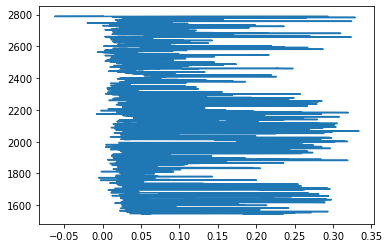
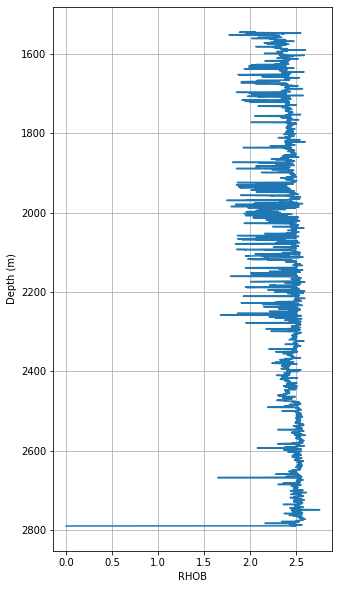

# Log ASCII Files 

Python has some very specific packages/libraries. You can often create your own tools for doing niche tasks, but often you will find a variety of tools to make things simpler for you. We will show some simple tasks to perfrom on borehole data (in .las format) with the [lasio](https://lasio.readthedocs.io/en/latest/) library. 

This tutorial based off https://towardsdatascience.com/handling-big-volume-of-well-log-data-with-a-boosted-time-efficiency-with-python-dfe0319daf26

Original Data from:
https://sarigbasis.pir.sa.gov.au/WebtopEw/ws/samref/sarig1/image/DDD/PEDP013LOGS.zip

Title:	Cooper Basin selected well logs in LAS format.
Publication Date:	November 20
Prepared by:	Energy Resources Division, Department of the Premier and Cabinet
This Record URL:	https://sarigbasis.pir.sa.gov.au/WebtopEw/ws/samref/sarig1/wci/Record?r=0&m=1&w=catno=2040037


```python
#For plotting
import matplotlib.pyplot as plt

#Library specifically for "well data"
import lasio

#To read files
import glob

#For "regular expression manipulation"
import re
```


```python
#Build a list of filenames to read
read_files = glob.glob("../data/WELL/*.las")
read_files
```


    ['../data/WELL/Balnaves.las',
 '../data/WELL/Banyula.las',
 '../data/WELL/Beachport1.las',
 '../data/WELL/BeachportEast1.las',
 '../data/WELL/BiscuitFlat1.las',
 '../data/WELL/BoolLagoon1.las',
 '../data/WELL/Bungaloo1.las',
 '../data/WELL/Burrungule1.las']


```python
#Cut out just the name of the well from the filenames
well_names = []
for file in read_files:
    print("FILE:", file)
    well=re.split('/|.las',file)
    print("SPLIT:", well)
    well_names.append(well[3])

print("There are ", len(well_names), "wells.")
print(well_names)
```

    FILE: WELL/Balnaves.las
    SPLIT: ['WELL', 'Balnaves', 'las']
    FILE: WELL/Banyula.las
    SPLIT: ['WELL', 'Banyula', 'las']
    FILE: WELL/Beachport1.las
    SPLIT: ['WELL', 'Beachport1', 'las']
    FILE: WELL/BeachportEast1.las
    SPLIT: ['WELL', 'BeachportEast1', 'las']
    FILE: WELL/BiscuitFlat1.las
    SPLIT: ['WELL', 'BiscuitFlat1', 'las']
    FILE: WELL/BoolLagoon1.las
    SPLIT: ['WELL', 'BoolLagoon1', 'las']
    FILE: WELL/Bungaloo1.las
    SPLIT: ['WELL', 'Bungaloo1', 'las']
    FILE: WELL/Burrungule1.las
    SPLIT: ['WELL', 'Burrungule1', 'las']
    There are  8 wells.
    ['Balnaves', 'Banyula', 'Beachport1', 'BeachportEast1', 'BiscuitFlat1', 'BoolLagoon1', 'Bungaloo1', 'Burrungule1']


```python
#Read in the log files to lasio
lases = []
for files in read_files:
    las = lasio.read(files)
    lases.append(las)
```


```python
#You can get an idea of what you can interogate using the help function
help(lases)
```

    Help on list object:
    
    class list(object)
     |  list(iterable=(), /)
     |  
     |  Built-in mutable sequence.
     |  
     |  If no argument is given, the constructor creates a new empty list.
     |  The argument must be an iterable if specified.
     |  
     |  Methods defined here:
...
    


```python
#This is just a regular Python list! But the list contains
#in this case, special objects known as "LasFile(s)" or lasio.las object.
#Get some details using help again
help(lases[1])
```

    Help on LASFile in module lasio.las object:
    
    class LASFile(builtins.object)
     |  LASFile(file_ref=None, **read_kwargs)
     |  
     |  LAS file object.
     |  
     |  Keyword Arguments:
     |      file_ref (file-like object, str): either a filename, an open file
     |          object, or a string containing the contents of a file.
     |  
     |  See these routines for additional keyword arguments you can use when
...


```python
#From there we can get some info from each of the wells
j=0
for well in lases:
    #e.g. pull out the varaibles availble from the wells
    print("Wellid:", j, well_names[j])
    j+=1
    print(well.keys())
```

    Wellid: 0 Balnaves
    ['DEPTH', 'CALI', 'DRHO', 'DT', 'GR', 'MINV', 'MNOR', 'NPHI', 'PEF', 'RDEP', 'RHOB', 'RMED', 'RMIC', 'SP']
    Wellid: 1 Banyula
    ['DEPTH', 'CALI', 'DRHO', 'DT', 'GR', 'NPHI', 'RDEP', 'RHOB', 'RMED', 'SP']
    Wellid: 2 Beachport1
    ['DEPTH', 'CALI', 'MINV', 'MNOR', 'RDEP', 'RMED', 'SP']
    Wellid: 3 BeachportEast1
    ['DEPTH', 'GR', 'RDEP', 'RMED', 'SP']
    Wellid: 4 BiscuitFlat1
    ['DEPTH', 'CALI', 'DRHO', 'DT', 'GR', 'MINV', 'MNOR', 'NPHI', 'PEF', 'RDEP', 'RHOB', 'RMED', 'RMIC', 'SP']
    Wellid: 5 BoolLagoon1
    ['DEPTH', 'CALI', 'DRHO', 'DT', 'GR', 'NPHI', 'PEF', 'RDEP', 'RHOB', 'RMED', 'SP']
    Wellid: 6 Bungaloo1
    ['DEPTH', 'CALI', 'DRHO', 'DT', 'DTS', 'GR', 'NPHI', 'PEF', 'RDEP', 'RHOB', 'RMED', 'RMIC', 'SP']
    Wellid: 7 Burrungule1
    ['DEPTH', 'CALI', 'DT', 'GR', 'RDEP', 'RMED', 'SP']


```python
#Set a wellid you want to explore more
wellid=1
```


```python
#Make a plot of one of the wells
plt.plot(lases[wellid]['DRHO'],lases[wellid]['DEPTH'])
```


    [<matplotlib.lines.Line2D at 0x7f22c1519890>]


    

    


```python
#Get some more info out of the well data
print(lases[wellid].curves)
```

    Mnemonic  Unit   Value  Description                                         
    --------  ----   -----  -----------                                         
    DEPTH     M             Depth                                               
    CALI      in            Caliper     CALI Edited, Spliced, BANYU001.G01.lis  
    DRHO      g/cm3         DenCorr     DRHO Edited, BANYU001.G01.lis           
    DT        us/ft         Sonic       DT Edited, Spliced, BANYU001.G01.lis    
    GR        gAPI          GammaRay    GR Spliced, BANYU001.G01.lis            
    NPHI      dec           Neutron     NPHI Edited, BANYU001.G01.lis           
    RDEP      ohmm          DeepRes     ILD Spliced, BANYU001.G01.lis           
    RHOB      g/cm3         Density     RHOB Edited, BANYU001.G01.lis           
    RMED      ohmm          MedRes      ILM Spliced, BANYU001.G01.lis           
    SP        mV            SponPot     SP Spliced, BANYU001.G01.lis            


```python
# Finally, make a reasonable plot
var = 'RHOB' 
print("Param:", var, "of well:", well_names[wellid])
plt.figure(figsize=(5,10))
plt.plot((lases[wellid][var]), (lases[wellid]['DEPTH']))

#And change some details on the plot
plt.xlabel(var); plt.ylabel("Depth (m)")
plt.grid(True)
plt.gca().invert_yaxis()
```

    Param: RHOB of well: Banyula


    



# SEGY Seismic data processing
```python
from obspy.io.segy.segy import _read_segy
import matplotlib.pyplot as plt
import numpy as np

#Adapted from https://agilescientific.com/blog/2016/9/21/x-lines-of-python-read-and-write-seg-y
#See the notebooks here for more good examples
#https://hub-binder.mybinder.ovh/user/agile-geoscience-xlines-n1mojurk
```


```python
#Set the filename of the segy data

filename="james/james_1959_pstm_tvfk_gain.sgy"

#Title: 2006 James 3D Seismic Survey.
#Author: White, A.
#Prepared by: Terrex Seismic Pty Ltd; Pioneer Surveys Pty Ltd; WestenGeco
#Tenement: PPL00182
#Operator: Santos Ltd
#https://sarigbasis.pir.sa.gov.au/WebtopEw/ws/samref/sarig1/wci/Record?r=0&m=1&w=catno=2035790
```


```python
stream = _read_segy(filename, headonly=True)
stream
```


    48832 traces in the SEG Y structure.


```python
one_trace = stream.traces[10000]

plt.figure(figsize=(16,2))
plt.plot(one_trace.data)
plt.show()
```


    

    


```python
data = np.stack(t.data for t in stream.traces[12320:12320+500])
```


```python
stream.traces[10000]
```


    Trace sequence number within line: 10001
    1001 samples, dtype=float32, 250.00 Hz


```python
np.shape(stream.traces)
```


    (48832,)


```python
data.shape
```


    (500, 1001)


```python
vm = np.percentile(data, 95)
print("The 95th percentile is {:.0f}; the max amplitude is {:.0f}".format(vm, data.max()))
```

    The 95th percentile is 4365; the max amplitude is 34148


```python
plt.imshow(data.T, cmap="Greys", vmin=-vm, vmax=vm, aspect='auto')
```


    <matplotlib.image.AxesImage at 0x7fcc47d1ce90>


    

    


```python
plt.figure(figsize=(16,8))
plt.imshow(data.T, cmap="RdBu", vmin=-vm, vmax=vm, aspect='auto')
plt.colorbar()
plt.show()
```


    

    


```python
print(stream.textual_file_header.decode())
```

    C 1 CLIENT SANTOS                 COMPANY                       CREW NO         C 2 LINE    2000.00 AREA JAMES3D                                                C 3 REEL NO           DAY-START OF REEL     YEAR      OBSERVER                  C 4 INSTRUMENT  MFG            MODEL            SERIAL NO                       C 5 DATA TRACES/RECORD 24569  AUXILIARY TRACES/RECORD       0 CDP FOLD    40    C 6 SAMPLE INTERVAL  4.00   SAMPLES/TRACE  1001 BITS/IN      BYTES/SAMPLE  4    C 7 RECORDING FORMAT        FORMAT THIS REEL SEG-Y  MEASUREMENT SYSTEM METERS   C 8 SAMPLE CODE FLOATING PT                                                     C09 JAMES 3D                                                                    C10 WESTERNGECO                                                                 C11 MARCH 2007                                                                  C12 VERSION : James3D_pstm_tvfk_gain                                            C13 FILTERED TRIM PSTM STACK                                                    C14                                                                             C15 GEOMETRY APPLY-TAR-MINP-                                                    C16 NOISE REDUCTION - SWATT                                                     C17  SC DECON - SCAC                                                            C18 RESIDUAL_STATICS                                                            C19  TRIM_STATICS - INVERSE_TAR - SORT                                          C20 PSTM  - SORT  - GAIN                                                        C21 TRIM_STATICS - STACK                                                        C22 SPECW_10-70HZ -TVF_10-75HZ-TRACE_BALANCE                                    C23                                                                             C24                                                                             C25                                                                             C26                                                                             C27                                                                             C28                                                                             C29                                                                             C30                                                                             C31                                                                             C32                                                                             C33                                                                             C34                                                                             C35                                                                             C36                                                                             C37                                                                             C38                                                                             C39                                                                             C40 END EBCDIC                                                                  


```python
print(stream.traces[50].header)
```

    trace_sequence_number_within_line: 51
    trace_sequence_number_within_segy_file: 51
    original_field_record_number: 2000
    trace_number_within_the_original_field_record: 1
    energy_source_point_number: 10055
    ensemble_number: 10055
    trace_number_within_the_ensemble: 51
    trace_identification_code: 1
    number_of_vertically_summed_traces_yielding_this_trace: 1
    number_of_horizontally_stacked_traces_yielding_this_trace: 24
    data_use: 1
    distance_from_center_of_the_source_point_to_the_center_of_the_receiver_group: 0
    receiver_group_elevation: 0
    surface_elevation_at_source: 0
    source_depth_below_surface: 0
    datum_elevation_at_receiver_group: 0
    datum_elevation_at_source: 0
    water_depth_at_source: 0
    water_depth_at_group: 0
    scalar_to_be_applied_to_all_elevations_and_depths: 1
    scalar_to_be_applied_to_all_coordinates: 1
    source_coordinate_x: 482680
    source_coordinate_y: 7035256
    group_coordinate_x: 482680
    group_coordinate_y: 7035256
    coordinate_units: 1
    weathering_velocity: 0
    subweathering_velocity: 0
    uphole_time_at_source_in_ms: 0
    uphole_time_at_group_in_ms: 0
    source_static_correction_in_ms: 0
    group_static_correction_in_ms: 0
    total_static_applied_in_ms: -70
    lag_time_A: 0
    lag_time_B: 0
    delay_recording_time: 0
    mute_time_start_time_in_ms: 0
    mute_time_end_time_in_ms: 20
    number_of_samples_in_this_trace: 1001
    sample_interval_in_ms_for_this_trace: 4000
    gain_type_of_field_instruments: 0
    instrument_gain_constant: 0
    instrument_early_or_initial_gain: 0
    correlated: 0
    sweep_frequency_at_start: 0
    sweep_frequency_at_end: 0
    sweep_length_in_ms: 0
    sweep_type: 0
    sweep_trace_taper_length_at_start_in_ms: 0
    sweep_trace_taper_length_at_end_in_ms: 0
    taper_type: 0
    alias_filter_frequency: 0
    alias_filter_slope: 0
    notch_filter_frequency: 0
    notch_filter_slope: 0
    low_cut_frequency: 0
    high_cut_frequency: 0
    low_cut_slope: 0
    high_cut_slope: 0
    year_data_recorded: 0
    day_of_year: 0
    hour_of_day: 0
    minute_of_hour: 0
    second_of_minute: 0
    time_basis_code: 0
    trace_weighting_factor: 0
    geophone_group_number_of_roll_switch_position_one: 0
    geophone_group_number_of_trace_number_one: 0
    geophone_group_number_of_last_trace: 0
    gap_size: 0
    over_travel_associated_with_taper: 0
    x_coordinate_of_ensemble_position_of_this_trace: 0
    y_coordinate_of_ensemble_position_of_this_trace: 0
    for_3d_poststack_data_this_field_is_for_in_line_number: 0
    for_3d_poststack_data_this_field_is_for_cross_line_number: -4587520
    shotpoint_number: 2000
    scalar_to_be_applied_to_the_shotpoint_number: 0
    trace_value_measurement_unit: 10055
    transduction_constant_mantissa: 0
    transduction_constant_exponent: 0
    transduction_units: 0
    device_trace_identifier: 0
    scalar_to_be_applied_to_times: 57
    source_type_orientation: 0
    source_energy_direction_mantissa: 0
    source_energy_direction_exponent: 584
    source_measurement_mantissa: 0
    source_measurement_exponent: 0
    source_measurement_unit: 0
    


```python
dt = stream.traces[0].header.sample_interval_in_ms_for_this_trace / 1e6
dt
```


    0.004


    


```python

```
