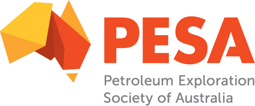

This course is aimed at researchers, students, and industry professionals who want to learn about the capabilities of Python and get experience using it applied to real-world problems. This course will introduce you to foundations of Python programming. We will utilise common geoscience data types (geospatial, temporal, vector, raster, etc) to demonstrate a variety of practical workflows and showcase fundamental capabilities of Python. We will carry out exploratory, analytical, computational and machine learning analyses on these datasets. At the end of the course you will be able to adapt these workflows to your own datasets. 

The course is presented by the <a href="https://www.sydney.edu.au/research/facilities/sydney-informatics-hub.html">Sydney Informatics Hub</a> on behalf of the <a href="https://pesa.com.au/events/pesa-qld-online-course-introduction-to-python-for-geoscience/">Petroleum Exploration Society of Australia</a>.

<figure>
  
</figure>

<figure>
  
</figure>

The Sydney Informatics Hub (SIH) is a _[Core Research Facility](https://sydney.edu.au/research/facilities.html)_ of the University of Sydney. Core Research Facilities centralise essential research equipment and services that would otherwise be too expensive or impractical for individual Faculties to purchase and maintain. We provide a wide range of research services to aid investigators, such as:

* [Training and workshops](https://sydney.edu.au/research/facilities/sydney-informatics-hub/workshops-and-training.html)
* [Project consulting and assistance](https://sydney.edu.au/research/facilities/sydney-informatics-hub/project-support.html) with Statistics, Data Science, Research Engineering, Bioinformatics, Modeling/Simulation/Visualisation, High Performance Computing.
* [Research data management](https://sydney.edu.au/research/facilities/sydney-informatics-hub/digital-research-infrastructure.html) consulting and platform support.

We also aim to cultivate a **data community**, organising monthly [Hacky Hours](https://sydney.edu.au/research/facilities/sydney-informatics-hub/workshops-and-training/hacky-hour.html), outside training events (eg NVIDIA, Pawsey Center), and data/coding-related events. Look out for everything happening on our [calendar](https://www.sydney.edu.au/research/facilities/sydney-informatics-hub/workshops-and-training/training-calendar.html) or contact us (at sih.info@sydney.edu.au) to get some digital collaboration going.

# Trainers
* Nathaniel (Nate) Butterworth (PhD Computational Geophysics), nathaniel.butterworth@sydney.edu.au
* Darya Vanichkina (PhD Bioinformatics, FHEA) 
* Jianzhou Zhao (PhD Environmental Engineering)
* Kristian Maras (MSc Quant Fin)

# Course pre-requisites and setup requirements

No previous programming experience is required, but **Session 1 is a pre-requisite for the other sessions**. Training will be delivered online, so you will need access to a modern computer with a stable internet connection and around 5GB of storage space downloaded prior to the course. Participants are encouraged to setup a Python environment on their local computer (as per the [Setup Instructions](https://sydney-informatics-hub.github.io/geopython/setup.html) provided), but participation using other platforms/environments can be supported where necessary.

# Venue, online via Zoom
Participants will be provided with a Zoom link. Trainers will be broadcasting from Sydney.

# Zoom etiquette and how we interact
Everything will be done via Zoom. Sessions will be recorded for attendees only, and it is set up to only record the host shared screen and host audio. We will try and get these uploaded to this site as soon as possible. 

Please interrupt whenever you want! Ideally, have your camera on and interact as much as possible. There will be someone monitoring the chat-window with any questions you would like to post there.  Four hours is a long Zoom session so we have plenty of scheduled breaks combined with a mix of content to be delivered as demos, plus sections as independent exercises, but most of the course will be pretty-hands on with everyone writing their own code. 

We will use Zoom break-out rooms if needed with the Trainers.

# Code of Conduct
We expect all attendees of our training to follow our code of conduct, including bullying, harassment and discrimination prevention policies.

In order to foster a positive and professional learning environment we encourage the following kinds of behaviours at all our events and on our platforms:

* Use welcoming and inclusive language
* Be respectful of different viewpoints and experiences
* Gracefully accept constructive criticism
* Focus on what is best for the community
* Show courtesy and respect towards other community members

Our full CoC, with incident reporting guidelines, is available at [https://pages.github.sydney.edu.au/informatics/sih_codeofconduct/](https://pages.github.sydney.edu.au/informatics/sih_codeofconduct/)

# General session timings

* Start at 12:35pm promptly. 
* 5 min to discuss feedback and summarise previous week.
* 1 hour of content.
* 10 min break.
* 1 hour content
* 10 min break
* 1 hour content
* 10 min break
* Until 16:25pm summary + hack session til close. This will be an opportunity to get one-on-one support, or we will deviate from lesson plans if interesting questions arise. If there are particular problems or datasets you would be interested in solving/exploring, email us in advanced and we can either do it as a group (if appropriate) or break out into smaller groups.

# Date & Time (in AEST-Brisbane time):	

We will be working through the following general content over our 4 sessions together.

**Session 01 Python fundamentals**
Wed April 21, 12:30 pm - 4:30 pm (AEST)

**Session 02 Specialist python libraries and data analysis for geoscience**
Wed April 28, 12:30 pm - 4:30 pm (AEST)

**Session 03 Pattern recognition and prediction in geoscience**
Wed May 5, 12:30 pm - 4:30 pm (AEST)

**Session 04 Large data and long running workflow strategies**
Wed May 12, 12:30 pm - 4:30 pm (AEST)

 

# Setup Instructions

Please complete the [Setup Instructions](https://sydney-informatics-hub.github.io/geopython/setup.html) **before the course**.

If you have any trouble, please get in contact with us ASAP.

