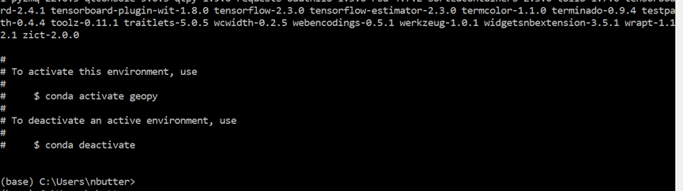

# 1. Get a Python client
We generally use and recommend Miniconda Python distribution: [https://docs.conda.io/en/latest/miniconda.html](https://docs.conda.io/en/latest/miniconda.html). But feel free to use whatever one works for you (and the course materials). We will be using Miniconda3-py37_4.8.3.

You can get this specific version here for:

* [Windows 64 bit Download](https://repo.anaconda.com/miniconda/Miniconda3-py37_4.8.3-Windows-x86_64.exe)

* [Mac OSX Download](https://repo.anaconda.com/miniconda/Miniconda3-py37_4.8.3-MacOSX-x86_64.pkg)

* [Linux Download](https://repo.anaconda.com/miniconda/Miniconda3-py37_4.8.3-Linux-x86_64.sh)

Follow the prompts (the default recommendations in the installer are generally fine.) 
Once installed, launch an "Anaconda Prompt" from the Start Menu / Applications Folder to begin your Python adventure. 


# 2. Setup your Python environment (install required packages and libraries)

Next we need to set up an environment with all the additional packages and libraries we will be using throughout the course.

* Download the [python environment file from here](requirements/environment.yml) (this is a small text file with instructions inside it). You may have to "Right Click > Save link as..." to download it.
* Launch an Anaconda Prompt (miniconda3).

https://raw.githubusercontent.com/Sydney-Informatics-Hub/geopython/main/requirements/environment.yml?token=ABL2U2WIAKMNCJE2RNZMHGDAP6F7C)


* Assuming you have downloaded the file to your Downloads folder. Type in the below command at the prompt. This should take about 10 minutes to download ~1GB of data and complete:

```python
conda env create --name geopy --file=C:\Users\nbutter\Downloads\environment.yml
```




After the installation completes, activate the new environment with the following command.
```python
conda activate geopy
```

At anytime in the future you can install additional packages or create separate environments. We will discuss this more in the course. This particular environment should have the correct balance of versions with any dependencies accounted for.

Also, setup your workspace where we will be creating files and generating data, you can do this in your prompt (or just in Windows Explorer/OSX Finder). For me I will be working in top-level folder on my Desktop called ```geopython``` and a subdirectory called ```notebooks```.

```sh
cd C:\Users\Administrator\Desktop\
mkdir geopython
cd geopython
mkdir notebooks
```


## Launching the Jupyter/Python Notebook

Now you have built your environment with all the packages we need, you can launch it. We will be working mostly with Python Notebooks to run Python (as opposed to running an interpreter on the command line/prompt). Each time you restart your work you will have to follow these steps:

* Launch an Anaconda Prompt (or equivalent).
* Change directories to your workspace.
* Activate the ```geopy``` environment.
* Launch the Jupyter/Python Notebook server.

```sh
cd C:\Users\Administrator\Desktop\geopython
conda activate geopy
jupyter notebook
```


This will launch the Notebook server (and may automatically launch a web-browser and take you to the page). If the Notebook does not automatically start, copy the generated link into a browser.


# 3. Download the data

Download the data (280 MB inflated to 500 MB) for all the exercises from here:

[https://cloudstor.aarnet.edu.au/plus/s/IfOvRpOXhJyqTT0](https://cloudstor.aarnet.edu.au/plus/s/IfOvRpOXhJyqTT0)

Extract this to a directory you can work in.
Your file tree should look like something like this


```
.
|-- geopython
|   +-- notebooks
|   +-- data
|       |   +-- ...

```


# Other Options

## Google Colab

If the above options do not work for you, [Google Colab](https://colab.research.google.com/) can be used for an on-demand Python notebook. You will require a Google Account for this.

The data is also availble on Google Drive here:
https://drive.google.com/drive/folders/1b5TuOIZDhwf1UEMNQ0Jl5zDyn9dRwaRo?usp=sharing

And an example colab notebook (linking to that data) is here:
https://colab.research.google.com/drive/1Uw78l8SDyRjdeanSvnsGayFWf_AJbZL1?usp=sharing

## Docker

If you are familiar with Docker you may use our Docker image with something like:
```
sudo docker run -it -p 8888:8888 nbutter/geopy:latest /bin/bash -c "jupyter notebook --allow-root --ip=0.0.0.0 --no-browser"
```
This will launch the Python notebok server in the ```/notebooks``` folder. Access the notebook by entering the genereated link in a web-browser, e.g.
```
http://127.0.0.1:8888/?token=9b16287ab91dc69d6b265e6c9c31a49586a35291bb20d0ab
```


